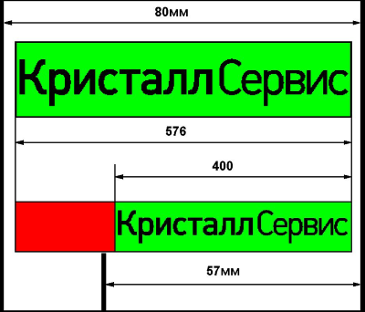

<<<<<< Pirit2f 1.05 
# Инструкция по программированию ККТ Пирит 2Ф ФФД 1.05
<<<<<< Pirit2f 1.1 
# Инструкция по программированию ККТ Пирит 2Ф ФФД 1.1
<<<<<< FM16 1.05
# Инструкция по программированию FM16 ФФД 1.05
<<<<<< FM16 1.1
# Инструкция по программированию FM16 ФФД 1.1
<<<<<< common

# Описание протокола
## Формат протокола передачи команд
Связь контрольно-кассовой техники (далее ККТ) с компьютером осуществляется по интерфейсу RS232 или USB в режиме виртуального COM порта. Параметры COM порта по умолчанию - 57600,n,8,1.  
Взаимодействие между кассовой программой (далее КП) инициируется со стороны КП: КП посылает командное сообщение (команду), а ККТ всегда посылает ответное сообщение (ответ). Взаимодействие КП с ККТ может осуществляться в двух режимах: синхронном и асинхронном. В синхронном режиме компьютер посылает команду и ждет ответ на него. После получения ответа компьютер посылает следующую команду. Взаимодействие в синхронном режиме может осуществляться без использования линий аппаратного квитирования (DTR/DSR, CTS/RTS). В асинхронном режиме компьютер посылает командные сообщения и принимает ответные сообщения в произвольной последовательности. Взаимодействие в этом режиме должно осуществляться с использованием линий аппаратного квитирования CTS/RTS.  
Взаимодействие ККТ с техническими средствами ОФД (далее ТС ОФД) осуществляется по протоколу TCP/IP. Инициатором отправки фискальных данных в ТС ОФД всегда выступает ККТ. Взаимодействие ККТ с ТС ОФД подробно изложено в описании протокола взаимодействия между ККТ и информационной (автоматизированной) системой оператора  фискальных данных, введенной в действие ФНС России 01.04.2016 

**Пакет команды со стороны КП**

1 | 2 | 3 | 4 | 5 | 6 | 7  
--- | --- | --- | --- | --- | --- | ---
STX | Пароль связи | ID пакета | Код команды | Данные | ETX | CRC  

**Пакет ответа со стороны ККТ**

1 | 2 | 3 | 4 | 5 | 6 | 7   
--- | --- | --- | --- | --- | --- | ---
STX | ID пакета | Код команды | Код ошибки | Данные | ETX | CRC  

  * STX - байт начала пакета (0x02).  
  * ETX - байт окончания пакета (0x03).  
  * CRC - контрольная сумма пакета. Контрольная сумма подсчитывается по алгоритму: выполнение операции XOR для всех байт блока, включая ETX, но исключая STX. Данные контрольной суммы занимают два байта и являются символьным представлением числа в шестнадцатеричной системе исчисления.  
  * ID пакета - идентификатор пакета. Произвольный байт, имеющий код в промежутке между 0x20 и 0xF0. ID пакета в ответе на команду, всегда совпадает с ID пакета команды. Может использоваться для синхронизации пакета команды и ответа на нее в условиях многозадачности в приложении или в асинхронном режиме.  
  * Пароль связи - четырехбайтовый пароль, предназначенный для ограничения возможности несанкционированной работы с ККТ. Пароль по умолчанию - ”PIRI”.  
  * Код команды - два байта, представляющие собой код команды в шестнадцатеричном исчислении, т.е. если код команды равен 0x21, необходимо передать два символа в виде – «21».  
  * Код ошибки - два байта, с символьным представлением числа в шестнадцатеричном исчислении. Поле содержит число «00» в случае успешного выполнения команды или код ошибки.  
  * Данные - параметры команды, или ответа на команду, разделенные между собой символом FS (0x1C).  Количество передаваемых и возвращаемых параметров зависит от кода конкретной команды.

## Специальные команды.
Специальные команды протокола состоят из одного байта в двоичном формате, без заголовка, концовки и контрольной суммы.

### 1.2.1 Проверка связи с ККТ
Для проверки связи с ККТ существует специальная команда:  
0x05 (ENQ) – проверка связи.  
Ответ состоит тоже из одного байта:  
0x06 (ACK) – ККТ на связи.  
Если в момент проверки связи ККТ передает данные в ответ на другую команду, то ответ может быть получен только после завершения этой передачи.

### 1.2.3 Промотка бумаги
Для промотки бумаги в ККТ существует специальная команда:  
0x0A (LF) – промотать бумагу на одну строку.

## Времена ожидания
В протоколе обмена данными между ККТ и КП предусмотрены следующие времена ожидания:  
1. Время ожидания приема между байтами пакета информации – 200 мс. По истечении данного промежутка времени возвращается код ошибки передачи.  
2. Время ожидания ответа от ККТ - зависит от выполняемой ККТ в данный момент операции. Для принятия решения о неисправности ККТ (коммуникационного порта или кабеля передачи данных) необходимо использовать команду “Проверка связи с ККТ”.  
3. Таймер ФН Период издания Клиентом ККТ события «Таймер ФН». Значение длительности таймера может находится в пределах от 0 секунд (непрерывный программный цикл) до 60 секунд. Длительность таймера – фиксированная и составляет 30 секунд.  
4. Таймер С! В этом состоянии Клиент ККТ взводит таймер на ожидание повторной попытки установления соединения транспортного уровня (событие «Таймер С»). Период издания Клиентом ККТ события «Таймер С» устанавливается в диапазоне от 0 секунд (непрерывный программный цикл) до 3600 секунд. Длительность таймера составляет 60 секунд.

## Основные типы передаваемых параметров

### Строка
Любая последовательность символов, с кодами от 0x20 до 0xF0. Длина конкретной строки зависит от значения передаваемого параметра. Может иметь нулевую длину (пустая строка).  Для печати символов на русском языке необходимо использовать кодировку CP866.

### Дата
Строка длиной 6 символов вида «ДДММГГ», где:  
ДД	- день месяца;  
ММ	- номер месяца в году;  
ГГ	- последние две цифры года.  
Все числа передаются с точностью до 2-х цифр, если число меньше 10-ти, то добавляется старший ноль.

### Время
Строка длиной 6 символов вида «ЧЧММСС», где:  
ЧЧ	- часы;  
ММ	- минуты;  
СС	- секунды.  
Все числа передаются с точностью до 2-х цифр, если число меньше 10-ти, то добавляется старший ноль.

### Целое число
Строка состоящая только из цифр, и представляющей собой целое число в десятеричной системе исчисления. Пустая строка интерпретируется как ноль. Используется для передачи номеров, индексов, битовых масок(полей) и т.д.

### Дробное число
Строка состоящая из цифр, десятичной точки и знака «-». Пустая строка интерпретируется как ноль. Используется для передачи суммы, количества и процентных ставок. Рекомендуется передавать суммы с точностью 2 знака после десятичной точки (с точностью до копейки), процентные ставки с точностью до 4-х знаков после десятичной точки и количество до 9-ти знаков после десятичной точки.

### Имя оператора
Строка размером 0...64 символа. Если необходимо передать ИНН кассира, то его следует передать первыми и отделить символом '&', например:

> 112233445566&Васильева О.Е.

# Описание команд ККТ
# Запрос флагов статуса ККТ (0x00)
## Описание
Команда возвращает статус фатального состояния ККТ, статус текущих флагов ККТ и статус документа.

## Входные параметры
Нет

## Ответные параметры
 * (Целое число) Статус фатального состояния ККТ
 * (Целое число) Статус текущих флагов ККТ
 * (Целое число) Статус документа

## Дополнительная информация

**Статус фатального состояния ККТ**

| Номер бита | Пояснение                                |
| ---------- | ---------------------------------------- |
| 0          | Неверная контрольная сумма NVR           |
| 1          | Неверная контрольная сумма в конфигурации |
| 2          | Нет связи с ФН                          |
| 3          | Зарезервировано                          |
| 4          | Зарезервировано                          |
| 5          | ККТ не авторизовано                      |
| 6          | Фатальная ошибка ФН                      |
| 7          | Зарезервировано                          |
<<<<<< FM16 1.05 FM16 1.1
8 | SD карта отсутствует или неисправна
<<<<<< common

   *При установке любого бита статуса фатального состояния блокируются все функции ККТ, за исключением битов 6 и 7, при установке которых доступны команды закрытия смены.*

**Статус текущих флагов ККТ**

| Номер бита | Пояснение                                |
| ---------- | ---------------------------------------- |
| 0          | Не была вызвана функция “Начало работы”  |
| 1          | Нефискальный режим                       |
| 2          | Смена открыта                            |
| 3          | Смена больше 24 часов                    |
| 4          | Архив ФН закрыт                          |
| 5          | ФН не зарегистрирован                    |
| 6          | Зарезервировано                          |
| 7          | Зарезервировано                          |
| 8          | Не было завершено закрытие смены, необходимо повторить операцию |
<<<<<< FM16 1.05 FM16 1.1
9 | Ошибка контрольной ленты
<<<<<< common

**Статус документа**

| Номер бита | Пояснение                                |
| ---------- | ---------------------------------------- |
| 0..3       | Тип текущего открытого документа (см. ниже) |
| 4..7       | Состояние документа (см. ниже)           |

**Тип текущего открытого документа**

| Значение | Пояснение                                |
| -------- | ---------------------------------------- |
| 0        | документ закрыт                          |
| 1        | сервисный документ                       |
| 2        | чек на продажу (приход)                  |
| 3        | чек на возврат (возврат прихода)         |
| 4        | внесение в кассу                         |
| 5        | инкассация                               |
| 6        | чек на покупку (расход)                  |
| 7        | чек на возврат покупки (возврат расхода) |

**Состояние документа**

| Значение | Пояснение                                |
| -------- | ---------------------------------------- |
| 0        | документ закрыт                          |
| 1        | устанавливается после команды "открыть документ" (Для типов документа 2 и 3 можно добавлять товарные позиции) |
| 2        | Устанавливается после первой команды "Подытог" |
| 3        | Устанавливается после второй команды "Подытог" или после начала команды "Оплата" (Можно только производить оплату различными типами платежных средств) |
| 4        | Расчет завершен, требуется закрыть документ |
| 8        | Команда закрытия документа была дана в ФН, но документ не был завершен. Аннулирование документа невозможно |

# Запрос сменных счетчиков и регистров (0x01)
## Описание
Эта команда позволяет получать различные значения сменных счетчиков и регистров ККТ.

## Входные параметры
 * (Целое число) Номер запроса

## Ответные параметры
 * (Целое число) Номер запроса
 * Возвращаемые данные. Тип и количество возвращаемых данных зависит от номера запроса

| Номер запроса (DEC) | Наименование Запроса                     | Формат возвращаемых данных               | Комментарии                              |
| ------------------- | ---------------------------------------- | ---------------------------------------- | ---------------------------------------- |
| 1                   | Вернуть номер текущей смены              | Целое число                              |                                          |
| 2                   | Вернуть номер следующего чека            | Целое число                              | Возвращается правильный номера чека только при автоматической нумерации чеков средствами самой ККТ. |
| 3                   | Вернуть суммы продаж по типам платежа    | Дробное число \* 16                      | Возвращается 16 значений – по максимально возможному количеству типов платежей |
| 4                   | Вернуть количество оплат по продажам     | Целое число \* 16                        |                                          |
| 5                   | Вернуть суммы возвратов по типам платежа | Дробное число \* 16                      |                                          |
| 6                   | Вернуть количество оплат по возвратам    | Целое число \* 16                        |                                          |
| 7                   | Вернуть количество оформленных чеков по типам операций | Целое число \*6            | Возвращается 6 значений – количество чеков продажи, возврата, аннулированных, отложенных, чеков внесения и изъятия |
| 8                   | Вернуть суммы по оформленным чекам       | Дробное число \* 4                       | Возвращается 4 значения – суммы по аннулированным и отложенным чекам, чекам внесения и изъятия |
| 9                   | Вернуть суммы по скидкам                 | Дробное число \* 4                       | Возвращает 4 значения - сумма скидок по продажам, 0, сумма скидок по возвратам, 0. |
| 10                  | Вернуть суммы налогов по продажам        | Дробное число \* 6                       |                                          |
| 11                  | Вернуть суммы налогов по возвратам       | Дробное число \*6                        |                                          |
| 12                  | Вернуть данные по последнему X отчету или отчету о закрытии смены | Строка, Целое число, Дробное число, Целое число, Дробное число, Целое число, Дробное число, Целое число, Дробное число, Целое число, Дробное число, Целое число, Дробное число | текущий операционный счетчик, номер документа, сумма в кассе, кол-во продаж (кол-во приходов), сумма продаж (сумма приходов), кол-во возвратов (возвратов прихода), сумма возвратов (возвратов прихода), количество аннулированных, сумма аннулированных, количество внесений, сумма внесений, количество изъятий, сумма изъятий |
| 13                  | Вернуть суммы по секциям/отделам по продажам | Дробное число \* 16                      | Возвращается 16 значений – по максимально возможному количеству секций/отделов |
| 14                  | Вернуть суммы по секциям/отделам по возвратам | Дробное число \* 16                      | Возвращается 16 значений – по максимально возможному количеству секций/отделов |
| 15                  | Вернуть количество оформленных чеков по типам операций | Целое число, Целое число                 | кол-во чеков покупок (расходов), кол-во чеков возвратов покупок (возвратов расхода) |
| 16                  | Вернуть суммы покупок по типам платежа   | Дробное число \* 16                      | Возвращается 16 значений – по максимально возможному количеству типов платежей. |
| 17                  | Вернуть суммы возвратов покупок по типам платежа | Дробное число \* 16                      | Возвращается 16 значений – по максимально возможному количеству типов платежей. |
<<<<<< FM16 1.05 Pirit2f 1.05
| 18                  | Вернуть данные по коррекциям             | Целое число, Дробное число \* 2          | Количество коррекций, Суммы коррекций наличными и безналичными |
<<<<<< FM16 1.1 Pirit2f 1.1
| 18                  | Вернуть данные по коррекциям             | Целое число, Дробное число \* 5          | Количество коррекций, Суммы коррекций наличными, безналичными, авансом, кредитом, иной формой оплаты |
<<<<<< common

# Запрос сведений о ККТ (0x02)
## Описание
Эта команда позволяет получать разнообразную информацию о ККТ.

## Входные параметры
 * (Целое число) Номер запроса.

## Ответные параметры
 * (Целое число) Номер запроса
 * Возвращаемые данные. Тип и количество возвращаемых данных зависит от номера запроса

| Номер запроса (DEC) | Наименование Запроса                     | Формат возвращаемых данных               | Комментарии                              |
| ------------------- | ---------------------------------------- | ---------------------------------------- | ---------------------------------------- |
| 1                   | Вернуть заводской номер ККТ              | Строка                                   |                                          |
| 2                   | Вернуть идентификатор прошивки           | Целое число                              |                                          |
| 3                   | Вернуть ИНН                              | Строка                                   |                                          |
| 4                   | Вернуть регистрационный номер ККТ        | Строка                                   |                                          |
| 5                   | Вернуть дату и время последней фискальной операции | Дата, Время                              |                                          |
| 6                   | Вернуть дату регистрации / перерегистрации | Дата                                     |                                          |
| 7                   | Вернуть сумму наличных в денежном ящике  | Дробное число                            |                                          |
| 8                   | Вернуть номер следующего документа       | Целое число                              |                                          |
| 9                   | Вернуть номер смены регистрации          | Целое число                              |                                          |
| 10                  | Вернуть номер следующего X отчета        | Целое число                              |                                          |
| 11                  | Вернуть текущий операционный счетчик     | Строка                                   |                                          |
| 12                  | Вернуть нарастающий итог                 | Дробное число, Дробное число, Дробное число, Дробное число | Продажа (приход), Возврат (возврат прихода), Покупка (расход), Возврат покупки (возврат расхода) |
<<<<<< FM16 1.05 Pirit2f 1.05
| 14                  | Вернуть дату окончания временного ресурса ФН | Дата                                     |                                          |
<<<<<< FM16 1.1 Pirit2f 1.1
| 14                  | Вернуть дату окончания временного ресурса ФН | Дата, Целое число | Дата окончания, количество дней до окончания временного ресурса ФН |
<<<<<< common
| 15                  | Вернуть тип прошивки                     | Целое число                              | 0 - стандартная прошивка, 1 - отладочный комплект |
| 16                  | Вернуть размер бумаги текущего дизайна   | Целое число                              | 0 - 80мм, 1 - 57мм                       |
| 17                  | Вернуть дату и время открытия смены      | Дата, Время                              |                                          |
<<<<<< FM16 1.05 FM16 1.1
18 | Вернуть количество символов в строке | Целое число | Для этого запроса можно вводить дополнительный входной параметр – номер шрифта. По умолчанию номер шрифта = 0
19 | Вернуть содержание регистра CID SD карты | Строка | Возвращается 16 байт регистра CID в HEX виде, начиная со старшего
20 | Вернуть содержание регистра CSD SD карты | Строка | Возвращается 16 байт регистра CSD в HEX виде, начиная со старшего
<<<<<< common
21 | Вернуть модель устройства | Целое число | |
<<<<<< FM16 1.05 FM16 1.1
22 | Вернуть битовую маску поддерживаемых интерфейсов и устройств. Если бит установлен - интерфейс или устройство может быть использовано | Целое число | Бит 0 - Зарезервирован, Бит 1 - Зарезервирован, Бит 2 - Наличие SD, Бит 3 - Наличие ФН
<<<<<< common
23 | Вернуть систему налогообложения и режим работы и ФН | Целое число, Целое число, Целое число | Система налогообложения, Режим работы, Признак установки принтера в автомате
24 | Вернуть максимальное количество дополнительных строк в начале и в конце чека | Целое число, Целое число | Максимальное количество строк в начале чека, Максимальное количество строк в конце чека
<<<<<< FM16 1.05 FM16 1.1
40 | Вернуть состояние перехода на НДС 20% | Целое число | 0 - переход на НДС 20% не был выполнен, 1 - ККТ работает с НДС 20%
<<<<<< common
70 | Вернуть рабочий идентификатор прошивки | Строка | Формат x.y.z, где x,y,z - числа до 3х знаков

# Запрос данных по чеку (0x03)
## Описание
Эта команда позволяет получать данные по чеку.

## Входные параметры
 * (Целое число) Номер запроса.

## Ответные параметры
 * (Целое число) Номер запроса
 * Возвращаемые данные. Тип и количество возвращаемых данных зависит от номера запроса

| Номер запроса (DEC) | Наименование Запроса                     | Формат возвращаемых данных               | Комментарии                              |
| ------------------- | ---------------------------------------- | ---------------------------------------- | ---------------------------------------- |
| 1                   | Вернуть счетчики текущего документа      | Дробное число \* 3                       | Возвращается 3 значения - сумма чека, сумма скидки по чеку, 0 |
| 2                   | Вернуть данные по последнему закрытому чеку | Целое число, Строка, Целое число, Целое число, Дробное число, Дробное число, Дробное число, Строка, Целое число | тип чека (для аннулиров. = 0), текущий операц. счетчик, номер чека, номер документа, сумма чека, сумма скидки по чеку, 0, строка ФП (фиск. признак), Номер ФД |

# Запрос состояния печатающего устройства (ПУ) (0x04)
## Описание
Эта команда позволяет получать состояние печатающего устройства.

## Входные параметры
Нет

## Ответные параметры
 * (Целое число) Статус печатающего устройства

## Дополнительная информация

**Статус печатающего устройства**

| Номер бита | Пояснение               |
| ---------- | ----------------------- |
| 0          | Принтер не готов        |
| 1          | В принтере нет бумаги   |
| 2          | Открыта крышка принтера |
| 3          | Ошибка резчика принтера |
| 7          | Нет связи с принтером   |

# Запрос сервисной информации (0x05)
## Описание
Эта команда позволяет получать разнообразную сервисную информацию о ККТ.

## Входные параметры
 * (Целое число) Номер запроса.

## Ответные параметры
 * (Целое число) Номер запроса
 * Возвращаемые данные. Тип и количество возвращаемых данных зависит от номера запроса

Номер запроса (DEC) | Наименование Запроса | Формат возвращаемых данных | Комментарии
--- | --- | --- | ---
<<<<<< Pirit2f 1.05 Pirit2f 1.1
1 | Вернуть напряжение питания (мВ) Целое число | Возвращается значение в милливольтах | |
2 | Вернуть температуру термоголовки | Целое число | Возвращается значение в  градусах
3 | Вернуть количество отрезов резчика | Целое число | |
4 | Вернуть ресурс термоголовки | Целое число | Возвращается значение в  мм
5 | Обнулить количество отрезов резчика | - | |
6 | Обнулить ресурс термоголовки | - | |
<<<<<< common
7 | Вернуть напряжение на батарейке (мВ) | Целое число | Возвращается значение в милливольтах
<<<<<< Pirit2f 1.05 Pirit2f 1.1
8 | Вернуть количество отрезов резчика (необнуляемое) | Целое число | |
9 | Вернуть ресурс термоголовки (необнуляемый) | Целое число | Возвращается значение в  мм
<<<<<< FM16 1.05 FM16 1.1
10 | Вернуть тип ПУ | Строка | |
11 | Вернуть версию BIOS ПУ | Строка | |
12 | Вернуть серийный номер ПУ | Строка | |
13 | Вернуть дату изменения BIOS ПУ | Строка | |
<<<<<< common

# Запрос дополнительной информации об ошибках (0x06)
## Описание
Эта команда позволяет получать данные по ошибкам ФН и ККТ.

## Входные параметры
 * (Целое число) Номер запроса.

## Ответные параметры
 * (Целое число) Номер запроса
 * Возвращаемые данные. Тип и количество возвращаемых данных зависит от номера запроса

| Номер запроса (DEC) | Наименование Запроса                  | Формат возвращаемых данных | Комментарии                              |
| ------------------- | ------------------------------------- | -------------------------- | ---------------------------------------- |
<<<<<< Pirit2f 1.05 Pirit2f 1.1
| 1                   | Вернуть расширенный код ошибки  | Целое число                | Возвращается код, указывающий на причину возникновения ошибки (01h) “Функция невыполнима при данном статусе ККТ” |
<<<<<< FM16 1.05 FM16 1.1
| 1                   | Вернуть расширенный код ошибки  | Целое число, Строка  | код, указывающий на причину возникновения ошибки, текст ошибки |
<<<<<< common
| 2                   | Вернуть статус блокировок по ФН       | Целое число                | Возвращается битовая маска, значения бит указаны в соответствующей таблице |

## Дополнительная информация

**Расширенный код ошибки (0x01)**

| Номер ошибки (DEC) | Пояснение                                |
| ------------ | ---------------------------------------- |
| 0            | Ошибок не было                           |
| 1            | Не была вызвана функция “Начало работы”  |
| 2            | Нефискальный режим                       |
| 3            | Архив ФН закрыт                          |
| 4            | ФН не зарегистрирован                    |
| 5            | ФН уже зарегистрирован                   |
| 7            | Нет изменений для перерегистрации ФН     |
| 8            | Документ не был открыт                   |
| 9            | Предыдущий документ не закрыт            |
| 11           | Состояние документа не равно 1 (документ открыт, ввод позиций/печать текста) |
| 12           | Состояние документа не равно 1 или 2 (см. выше + была дана команда «Подытог») |
| 13           | Состояние документа не равно 1 или 2 или 3 (см. выше + была дана вторая команда «Подытог» либо начата оплата) |
| 14           | Состояние документа не равно 4 (расчёт завершён) |
| 15           | Документ закрыт в ФН                     |
| 16           | Документ не является продажей (приходом) или возвратом (возвратом прихода) |
| 17           | Документ не является внесением или изъятием |
| 18           | Документ не является сервисным           |
| 19           | Документ является сервисным              |
| 20           | Смена не открыта                         |
| 21           | Фатальная ошибка ФН                      |
| 22           | ФН не в режиме получения документа для ОФД |
| 23           | Не задан адрес сайта ФНС                 |
| 24           | Не задано наименование ОФД               |
| 25           | Не задан ИНН ОФД                         |
| 26           | Нулевой итог документа                   |
| 27           | Не задано место расчетов                 |
| 28           | Не задан номер автомата                  |
| 29           | Попытка добавить больше одного предмета расчета с признаком способа расчёта "Оплата кредита"|
| 30           | Не задан email отправителя чека          |
| 33           | Не задано имя кассира                    |
| 34           | Есть неотправленные в ОФД документы      |
| 35           | Допустима только одна скидка на чек      |
| 37           | Неверный регистрационный номер      |
| 38           | Невозможно изменить регистрационные данные      |
| 39           | Дата/время переданы неверно      |
| 40           | Неверный параметр "Тип документа"      |
| 41           | Неверный параметр "Номер отдела"      |
| 42           | Неверный параметр "Номер документа"      |
| 43           | Неверный параметр "Система налогообложения"      |
| 44           | Неверный параметр "Название товара"      |
| 45           | Неверный параметр "Артикул"      |
| 46           | Неверный параметр "Количество товара"      |
| 47           | Неверный параметр "Цена товара"      |
| 48           | Неверный параметр "Номер ставки налога"      |
| 49           | Неверный параметр "Номер товарной позиции"     |
| 50           | Неверный параметр "Номер секции"      |
| 51           | Неверный параметр "Название скидки"      |
| 52           | Неверный параметр "Сумма скидки"      |
| 53           | Неверный параметр "Признак способа расчета"      |
| 54           | Неверный параметр "Признак предмета расчета"      |
| 55           | Неверный параметр "Тип платежа"      |
| 56           | Неверный параметр "Сумма платежа"      |
| 57           | Неверный параметр "Дополнительный текст"      |
| 58           | Неверный параметр "Адрес покупателя"      |
| 59           | Неверный параметр "Замена ФН"      |
| 60           | Неверный параметр "ИНН пользователя"      |
| 61           | Неверный параметр "Режим работы"      |
| 62           | Автономный режим и шифрование      |
| 64           | Неверный признак агента      |
| 65           | Неверный код активации      |
| 66           | Неверный номер запроса      |
| 67           | Неверный номер платной услуги      |
| 68           | Обновите прошивку ККТ для работы с табачной продукцией      |
| 69           | Введённый тип маркировки не поддерживается      |
| 70           | У вас активирован универсальный ключ      |
| 71           | Неверный параметр "Дополнительный реквизит чека"      |
| 72           | Неверный параметр "Наименование дополнительного реквизита пользователя"      |
| 73           | Неверный параметр "Значение дополнительного реквизита пользователя"      |
| 74           | Услуга ФФД 1.1 не активирована      |

**Статус блокировок по ФН**

| Номер бита | Пояснение                            |
| ---------- | ------------------------------------ |
| 0          | Зарезервировано                      |
| 1          | ФН не найден                         |
| 2          | Не был закрыт архив ФН               |
| 3          | Ошибка теста архива ФН               |
| 4          | Ошибка связи с  ФН                   |
| 5          | Не завершена операция закрытия смены |
| 6          | Зарезервировано                      |
| 7          | ФН заполнен                          |

# Начало работы с ККТ (0x10)
## Описание
Эта функция вызывается всегда перед началом работы с ККТ.
Дата и время необходимы для проверки и согласования даты и времени работы КП и ККТ. Если разница между передаваемым в команде ”Начало работы” временем и текущим временем ККТ меньше 8 минут, то синхронизация ККТ происходит автоматически, если разница больше – возвращается один из кодов ошибки 0x0B или 0x0С.

Ошибка 0x0B возникает, в случае если передаваемые в команде ”Начало работы” дата и время отличаются от текущих даты и времени ККТ более чем на 8 минут. В случае возврата от ККТ ошибки 0x0B команда выполняется и ККТ может продолжить работу по своему внутреннему времени. При получении такого кода ошибки рекомендуется проверить время на управляющем компьютере, и, если оно верно, то выполнить следующие действия:

 * закрыть смену (в случае если она открыта)
 * установить время в ККТ соответствующей командой.

Ошибка 0x0С возникает, в случае если передаваемая в команде ”Начало работы” дата меньше даты последней фискальной операции зарегистрированной в ККТ. В случае возврата ошибки 0x0С команда инициализации не выполняется, т.е. блокируются все операции ККТ. При получении такого кода ошибки рекомендуется проверить дату и время на управляющем компьютере и сравнить его с датой и временем последней фискальной операции. В случае если установлена неправильная дата на управляющем компьютере, ее необходимо исправить и затем повторно выполнить команду ”Начало работы”.

## Входные параметры
 * (Дата)Текущая дата
 * (Время)Текущее время

## Ответные параметры
Нет

# Чтение таблицы настроек (0x11)
## Описание
Команда содержит два параметра для адресации элемента таблицы, значение которого необходимо получить.

## Входные параметры
 * (Целое число) Номер
 * (Целое число) Индекс (для массивов)

## Ответные параметры
 * (Тип элемента таблицы) Значение элемента таблицы

# Запись таблицы настроек (0x12)
## Описание
Команда содержит три параметра: два параметра для адресации элемента таблицы, и новое значение элемента таблицы.
Регистрационные данные менять нельзя.
При записи "наименования пользователя" (1 и 2 строка) и "адреса расчетов" (1 и 2 строка) ошибки не будет, однако данные не изменятся.

## Входные параметры
 * (Целое число) Номер
 * (Целое число) Индекс (для массивов)
 * (Тип элемента таблицы) Новое значение элемента таблицы

## Ответные параметры
Нет

# Чтение даты/времени ККТ (0x13)
## Описание
Эта команда позволяет получить время и дату ККТ.

## Входные параметры
Нет

## Ответные параметры
 * (Дата) Текущая дата
 * (Время) Текущее время

# Запись даты/времени ККТ (0x14)
## Описание
Эта команда позволяет устанавливать новые время и дату ККТ, при условии закрытой смены. Вводимая дата не может быть более ранней, чем дата последней фискальной операции.  При попытке ввода такой даты, ККТ блокируется, и устанавливает флаг статуса “Не была вызвана функция Начало работы”. Для снятия блокировки, необходимо установить корректную дату и вызвать функцию “Начало работы”.
Если новые значения времени/даты больше текущих, более чем  на 24 часа, в ответе на данную команду возвращается ошибка 0x0A. Для установки таких значений времени и даты, после возврата ошибки 0x0A , команда должна подаваться повторно.

## Входные параметры
 * (Дата) Текущая дата
 * (Время) Текущее время

## Ответные параметры
Нет

# Программировать логотип (0x15)
## Описание
Функция используется для загрузки графического логотипа торгового предприятия для его печати перед каждым документом.

Образ логотипа представляет собой монохромное изображение в формате BMP со специальным символом 0x1B в начале. Ширина изображения – 576 точек, высота – от 8 до 220 точек. Для бумаги шириной 57мм зона печати ограничена 400 точками справа, 176 точек слева должны быть без изображения(см. рис. 1).

Команда выполняется в два этапа. На первом передается количество байт в образе логотипа.

Если команда выполнена успешно, ККТ присылает байт с кодом 0x06 (ACK), что обозначает готовность ККТ к приему логотипа, либо стандартный ответ с кодом ошибки.

На втором этапе передается сам образ логотипа, после загрузки которого возвращается стандартный ответ с кодом ошибки.

## Входные параметры
(Целое число) Количество байт

## Ответные параметры
Нет

# Удалить логотип (0x16)
## Описание
Функция используется для удаления ранее загруженного логотипа.

## Входные параметры
Нет

## Ответные параметры
Нет

<<<<<< Pirit2f 1.05 Pirit2f 1.1
# Загрузить дизайн чека (0x17)
## Описание
Функция используется для загрузки файла дизайнов чека.
Команда выполняется в два этапа. На первом передается количество байт в файле дизайнов. Если команда выполнена успешно, ККТ присылает байт с кодом 0x06 (ACK), что обозначает готовность ККТ к приему файла, либо стандартный ответ с кодом ошибки. На втором этапе передается сам файл, после загрузки которого возвращается стандартный ответ с кодом ошибки.

## Входные параметры
(Целое число) Количество байт

## Ответные параметры
Нет

# Загрузить графическое изображение (0x18)
## Описание
Максимальная ширина изображения при использовании бумаги шириной 80мм – 512 точек(64 мм).  Максимальный размер – 22000 байт. Максимальная ширина изображения при использовании бумаги шириной 57мм – 336 точек точек(42 мм). 176 точек слева должны быть без изображения(как показано на рис. 1).

Графика печатается прижатой к левому краю, вне зоны печати фискального логотипа. Если параметр смещение равен 0, картинка прижимается влево. Если параметр смещение равен 1, картинка выравнивается по центру. Если параметр смещение равен 2, картинка прижимается к правой границе зоны печати графики(512 точек).

Команда выполняется в два этапа. На первом передается параметры графики для печати.  В ответ ККТ присылает байт с кодом 0x06 (ACK), что обозначает готовность ККТ к приему графического изображения, либо стандартный ответ с кодом ошибки. На втором этапе передается само графическое изображение, после печати которого возвращается стандартный ответ с кодом ошибки.

## Входные параметры
 * (Целое число) Ширина картинки
 * (Целое число) Высота картинки
 * (Целое число) Смещение по умолчанию
 * (Строка)[1..15] – идентификатор картинки
 * (Целое число) Номер.

## Ответные параметры
Нет

# Поиск графического изображения (0x19)
## Описание
Функция используется поиска и проверки загруженного графического изображения в памяти устройства.

## Входные параметры
 * (Строка)[1..15] – идентификатор картинки, передаваемый в команде 0x18.

## Ответные параметры
 * (Целое число) Номер. Если  идентификатор не найден, возвращается 0, если найден 1

<<<<<< common
# Сформировать отчет без гашения (X-отчет) (0x20)
## Описание
Сформировать отчет без гашения (X-отчет). Если касса зарегистрирована для использования в автоматическом режиме - имя оператора можно не передавать.

## Входные параметры
 * (Имя оператора) Имя оператора

## Ответные параметры
Нет

# Сформировать отчет о закрытии смены (0x21)
## Описание
Сформировать отчет о закрытии смены. Если касса зарегистрирована для использования в автоматическом режиме - имя оператора можно не передавать.

## Входные параметры
 * (Имя оператора) Имя оператора
 * (Целое число) Опции отчета

## Ответные параметры
Нет

# Открыть смену (0x23)
## Описание
Открыть смену. Если касса зарегистрирована для использования в автоматическом режиме - имя оператора можно не передавать.

## Входные параметры
 * (Имя оператора) Имя оператора

## Ответные параметры
Нет

# Установить дополнительные реквизиты позиции (0x24)
## Описание
Команда вызывается перед командой добавления товарной позиции и устанавливает дополнительные реквизиты. Действие команды распространяется на одну товарную позицию в открытом документе.

<<<<<< Pirit2f 1.1
В каждый параметр, отвечающий за номер телефона, можно добавить до трёх телефонных номеров. Для добавления нескольких номеров телефона нужно перечислить их через запятую, например "+79999999,+78888888,+71234567".
<<<<<< common
Каждый номер телефона должен начинаться с символа "+" и не должен превышать ограничение длины в 19 символов (включая "+").

## Входные параметры
 * (Строка[1..32]) Код товарной номенклатуры
 * (Строка[1..64]) Дополнительный реквизит предмета расчёта
 * (Строка[1..16]) Единица измерения предмета расчёта
 * (Целое число) Признак агента по предмету расчёта
 * (Строка)[0..12] ИНН поставщика
<<<<<< Pirit2f 1.1
 * (Строка)[0..60] Телефон(ы) поставщика
<<<<<< FM16 1.05 FM16 1.1 Pirit2f 1.05
 * (Строка)[0..19] Телефон поставщика
<<<<<< common
 * (Строка)[0..256] Наименование поставщика
 * (Строка)[0..256] Адрес оператора перевода (для банк.пл.агента/банк.пл.субагента, иначе пустой)
 * (Строка)[0..12] ИНН оператора перевода (для банк.пл.агента/банк.пл.субагента, иначе пустой)
 * (Строка)[0..64] Наименование оператора перевода (для банк.пл.агента/банк.пл.субагента, иначе пустой)
<<<<<< Pirit2f 1.1
 * (Строка)[0..60] Телефон(ы) оператора перевода (для банк.пл.агента/банк.пл.субагента, иначе пустой)
<<<<<< FM16 1.05 FM16 1.1 Pirit2f 1.05
 * (Строка)[0..19] Телефон оператора перевода (для банк.пл.агента/банк.пл.субагента, иначе пустой)
<<<<<< common
 * (Строка)[0..24] Операция платежного агента (для банк.пл.агента/банк.пл.субагента, иначе пустой)
<<<<<< Pirit2f 1.1
 * (Строка)[0..60] Телефон(ы) платежного агента (для пл.агента/пл.субагента, иначе пустой)
 * (Строка)[0..60] Телефон(ы) оператора по приему платежей (для пл.агента/пл.субагента, иначе пустой)
<<<<<< FM16 1.05 FM16 1.1 Pirit2f 1.05
 * (Строка)[0..19] Телефон платежного агента (для пл.агента/пл.субагента, иначе пустой)
 * (Строка)[0..19] Телефон оператора по приему платежей (для пл.агента/пл.субагента, иначе пустой)
<<<<<< common

## Ответные параметры
Нет

## Дополнительная информация
**Код товарной номенклатуры**

В поле «Код товарной номенклатуры» могут быть переданы шестнадцатеричные данные, каждый такой байт имеет вид: $xy, где  x и y – шестнадцатиричные цифры, например $C5 соответствует значению 0xC5. Количество предмет расчёта, для которого задан код товарной номенклатуры, должно равнятьсе единице.

**Признак агента по предмету расчета - битовая маска**

| Номер бита | Пояснение                                |
| ---------- | ---------------------------------------- |
| 0          | Банковский платежный агент               |
| 1          | Банковский платежный субагент            |
| 2          | Платежный агент                          |
| 3          | Платежный субагент                       |
| 4          | Поверенный                               |
| 5          | Комиссионер                              |
| 6          | Агент                              		|

#  Открыть документ (0x30)
## Описание
Эта команда открывает новый документ и переводит ККТ в режим ввода документа.

После успешного выполнения этой команды во внутренней переменной "статуса документа" устанавливается соответствующий тип текущего документа. Этот статус можно получить по команде “Запрос флагов статуса ККТ”.

Параметр режим и тип документа представляет собой битовую маску, определяющую тип открываемого документа и режим его формирования.

В пакетном режиме формирования документа, при успешном выполнении команд формирования чека (с кодами 0x24, 0x40..0x49, 0x52), ответ на команду не посылается. Если какая-либо команда выполняется с ошибкой, то на нее возвращается стандартный ответ с кодом ошибки. Последующие команды формирования чека (с кодами 0x24, 0x40..0x49, 0x52) игнорируются, на каждую такую комадну возвращается стандартный ответ с кодом ошибки "Функция невыполнима при данном статусе ККТ" до поступления команд “Завершить документ” или “Аннулировать документ”.

При возникновении ошибки в процессе наполнения документа в пакетном режиме необходимо аннулировать документ и полностью сформировать документ заново, начиная с команды "Открыть документ".

Параметр Номер документа учитывается при установке бита в таблице настроек ККТ "Нумерация чеков со стороны внешней программы" в значение "1". В других ситуациях параметр игнорируется.
Если касса зарегистрирована для использования в автоматическом режиме - имя оператора можно не передавать.
Если система налогообложения не передана, она будет выбрана по умолчанию (первая из зарегистрированных).

## Входные параметры
 * (Целое число) Режим и тип документа
 * (Целое число 1..99) Номер отдела
 * (Имя оператора) Имя оператора
 * (Целое число) Номер документа
 * (Число 0..5) Система налогообложения
<<<<<< Pirit2f 1.05 Pirit2f 1.1
 * (Строка) Адрес пользователя, строка 1
 * (Строка) Адрес пользователя, строка 2
<<<<<< common

## Ответные параметры
Нет

## Дополнительная информация

**Режим и тип документа**

| Номер бита | Пояснение                                |
| ---------- | ---------------------------------------- |
| 0..3       | Тип открываемого документа. 1 - Сервисный документ, 2 - Чек на продажу (приход), 3 - Чек на возврат (возврат прихода), 4 - Внесение в кассу, 5 - Инкассация, 6 - Чек на покупку (расход), 7 - Чек на возврат покупки (возврат расхода) |
| 4          | 0 - Обычный режим формирования документа, 1 - Пакетный режим формирования документа |
| 5          | 0 - Обычный режим печати реквизитов, 1 - Режим отложенной печати реквизитов |

**Система налогообложения**

| Значение | Пояснение                         |
| -------- | --------------------------------- |
| 0        | Общая                             |
| 1        | Упрощенная Доход                  |
| 2        | Упрощенная Доход минус Расход     |
| 3        | Единый налог на вмененный доход   |
| 4        | Единый сельскохозяйственный налог |
| 5        | Патентная система налогообложения |

# Завершить документ (0x31)
## Описание
Команда завершения документа.

Если параметр Флаг отрезки = 1, отрезка сервисных документов по завершению не выполняется. Если параметр Флаг отрезки = 5, отрезка чеков продажи, покупки и возвратов по завершению не выполняется.

Фискальный признак возвращается только при завершении чеков на приход, возврат прихода, расход и возврат расхода. 
В пакетном режиме формирования документа, команда “Завершить документ” выключает пакетный режим.

## Входные параметры
 * (Целое число) Флаг отрезки
 * (Строка) Адрес покупателя
 * (Число) Разные флаги
<<<<<< Pirit2f 1.05
 * (Строка) Место расчётов
 * (Строка) Адрес отправителя чеков
 * (Строка) Номер автомата
<<<<<< Pirit2f 1.05 FM16 1.05 FM16 1.1
 * (Строка) Название дополнительного реквизита пользователя
 * (Строка) Значение дополнительного реквизита пользователя
<<<<<< FM16 1.05 FM16 1.1 Pirit2f 1.1
 * (Строка)[0..128] Покупатель
 * (Строка)[0..12] ИНН покупателя
<<<<<< Pirit2f 1.1
 * (Строка) Место расчётов
 * (Строка) Адрес отправителя чеков
 * (Строка) Номер автомата
<<<<<< common

## Ответные параметры
 * (Целое число) Сквозной номер документа
 * (Строка) Операционный счетчик
 * (Строка) Строка ФД и ФП
 * (Число) ФД - номер фискального документа
 * (Число) ФП - фискальный признак
 * (Число) Номер смены
 * (Число) Номер документа в смене
 * (Строка) Дата документа
 * (Строка) Время документа

## Дополнительная информация

Полный набор ответных параметров возвращается только для фискальных чеков прихода, возврата прихода, расхода и возврата расхода. Для остальных документов возвращаются только сквозной номер документа и операционный счётчик.

**Разные флаги**

| Номер бита | Пояснение                                |
| ---------- | ---------------------------------------- |
| 0          | 0 - Обычный режим, 1 - Установить признак расчетов в интернет |

<<<<<< FM16 1.05 FM16 1.1 Pirit2f 1.1
**Покупатель**

Наименование организации или фамилия, имя, отчество (при наличии), серия и номер паспорта покупателя (клиента).
<<<<<< common

# Аннулировать документ (0x32)
## Описание
Эта команда прерывает формирование текущего документа, данные удаляются из оперативной памяти ККТ и печатается сообщение об аннулировании.

## Входные параметры
Нет

## Ответные параметры
Нет

# Отложить документ (0x33)
## Описание
Эта команда работает аналогично команде “Аннулировать документ”, но подается в случаях, когда документ отменяется не навсегда, а будет обязательно повторно введен, в течении данной смены. Данные документа удаляются из оперативной памяти ККТ и печатается причина отказа от чека.

Используя параметры печати отчета о закрытии смены в “Таблица настроек ККТ”, можно настроить в отчете о закрытии печать информации по отложенным за смену чекам. При этом, если команда "Отложить чек" выполняется без параметра(пустая строка), то такие чеки учитываются в отчете о закрытии, если с параметром – не учитываются.

## Входные параметры
 * (Строка[0..40]) Причина отказа от чека

## Ответные параметры
Нет

# Отрезать документ (0x34)
## Описание
Эта команда выполняет принудительную отрезку документа с предпечатью.

## Входные параметры
Нет

## Ответные параметры
Нет

<<<<<< Pirit2f 1.1
# Открыть чек коррекции (0x35)

## Описание
Команда открывает чек коррекции и переводит ККТ в режим ввода документа. Адрес пользователя необходимо передать только в том случае,
если при регистрации адрес пользователя не был указан, иначе этот параметр игнорируется. Команда работает аналогично команде открытия обычного чека, чек коррекции наполняется и закрывается с помощью команд, используемых для наполнения обычного чека.

## Входные параметры
 * (Имя оператора) Имя оператора
 * (Число 0..1) Тип коррекции
 * (Число 0..3) Тип операции
 * (Число 0..5) Система налогообложения
 * (Дата) Дата документа основания коррекции
 * (Строка[0..32]) Номер документа основания коррекции
 * (Строка[0..64]) Наименование документа основания коррекции
 * (Строка) Адрес пользователя, строка 1
 * (Строка) Адрес пользователя, строка 2

## Ответные параметры
Нет

## Дополнительная информация

**Тип коррекции**

| Значение   | Пояснение       |
| ---------- | --------------- |
| 0          | Самостоятельная |
| 1          | По предписанию  |

**Тип операции**

| Значение   | Пояснение       |
| ---------- | --------------- |
| 0          | Приход          |
| 1          | Расход          |
| 2          | Возврат прихода |
| 3          | Возврат расхода |

**Система налогообложения**

| Значение | Пояснение                         |
| -------- | --------------------------------- |
| 0        | Общая                             |
| 1        | Упрощенная Доход                  |
| 2        | Упрощенная Доход минус Расход     |
| 3        | Единый налог на вмененный доход   |
| 4        | Единый сельскохозяйственный налог |
| 5        | Патентная система налогообложения |
<<<<<< common

# Печать текста (0x40)
## Описание
C помощью данной команды печатается текст внутри открытого сервисного документа.

## Входные параметры
 * (Строка[1..72]) Текст
 * (Целое число) Атрибуты текста

## Ответные параметры
Нет

## Дополнительная информация
Атрибуты текста – опциональный параметр, представляющий собой битовую маску.

 * 0..3 бит - Номер шрифта

Номер шрифта | Пояснение
--- | ---
<<<<<< Pirit2f 1.05 Pirit2f 1.1
0 | Шрифт 13х24, 44 символа в строке
1 | Шрифт 10х20
2 | Шрифт 13х24 жирный
3 | Шрифт 10х20 жирный
4 | Шрифт 8х14, 56 символов в строке
5 | Шрифт 24х45
6 | Шрифт 24х45 жирный
<<<<<< FM16 1.05 FM16 1.1
0 | Шрифт 12х24
1 | Шрифт 9х17
<<<<<< common

 * 4 бит - Печать двойной высоты текста
 * 5 бит - Печать двойной ширины текста

# Печатать штрих-код (0x41)
## Описание
С помощью данной команды можно распечатать штрих-код товара.

## Входные параметры
 * (Целое число) Опции вывода
 * (Целое число) Ширина штрих-кода
 * (Целое число) Высота штрих-кода
 * (Целое число) Тип штрих-кода
 * (Строка) Штрих-код

## Ответные параметры
Нет

## Дополнительная информация
Опции вывода(для линейных кодов):

| Значение | Пояснение                  |
| -------- | -------------------------- |
| 0        | не выводить                |
| 1        | вывести наверху штрих-кода |
| 2        | вывести внизу              |
| 3        | вывести наверху и внизу    |

Опции вывода (PDF417) - пропорции высоты/ширины ШК в процентах (по умолчанию 50%)

Ширина штрих-кода - значение задается в точках и может быть от 2 до 8.

Для UPC-A и EAN-13 максимальная ширина штрих-кода = 6, для остальных кодов зависит от длины параметра “Штрих-код”.

Высота штрих-кода - значение задается в точках и может принимать значения от 1 до 255 (только для линейных кодов).

Тип штрих-кода - Определяет, какой штрих-код будет  напечатан. Длина и набор символов определяется типом штрих-кода:

| Значение | Пояснение          |
| -------- | ------------------ |
| 0        | UPC-A              |
| 1        | UPC-E              |
| 2        | EAN-13             |
| 3        | EAN-8              |
| 4        | Code 39            |
| 5        | Interleaved 2 of 5 |
| 6        | Codabar            |
| 7        | PDF417             |
| 8        | QR CODE            |
| 9        | Code 128 версии A  |

Штрих-код- строка содержащая штрих-код, причем контрольная сумма может и не указываться

# Добавить товарную позицию (0x42)
## Описание
Эта команда может быть вызвана сразу после открытия чека и может повторяться любое количество раз (если признак способа расчета не равен 7) внутри текущего документа для отражения всего списка товаров. Если позиция не может быть добавлена в ФН, на чеке после данных о позиции печатается строка “ОПЕРАЦИЯ ОТМЕНЕНА” и возвращается соответствующий код ошибки ФН.

Для повышения точности вычислений, можно передавать количество с точностью до 9 знаков после запятой, при этом в умножении на цену будет участвовать 9 знаков после запятой, а печататься только первые 3.

Сумма позиции, получаемая в результате умножения цены на количество, округляется к ближайшему целому, т.е. часть менее 0.5 коп отбрасывается, 0.5 коп и более округляется до 1 коп.

Параметры ”Номер товарной позиции” и “Номер секции” не являются обязательными и могут отсутствовать. Если номер секции отсутствует (или равен нулю), учет ведется на номер отдела, указанный при открытии документа.
Номер позиции - символьное поле, состоящее из цифр и символа разделителя, которым может быть пробел, двоеточие, тире и другие символы.

## Входные параметры
 * (Строка[0...256]) Название товара
 * (Строка[0..18]) Артикул или штриховой код товара/номер ТРК
 * (Дробное число) Количество товара в товарной позиции
 * (Дробное число[0..99999999.99]) Цена товара по данному артикулу
 * (Целое число) Номер ставки налога
 * (Строка[0..4]) Номер товарной позиции
 * (Целое число 1..16) Номер секции
 * (Целое число) Пустой параметр
 * (Строка[0...38]) Пустой параметр
 * (Дробное число) Сумма скидки
 * (Целое число) Признак способа расчета
 * (Целое число) Признак предмета расчета
 * (Строка[3]) Код страны происхождения товара
<<<<<< Pirit2f 1.05 Pirit2f 1.1
 * (Строка[0...24]) Номер таможенной декларации
<<<<<< FM16 1.05 FM16 1.1
 * (Строка[0...31]) Номер таможенной декларации
<<<<<< common
 * (Дробное число) Сумма акциза

## Ответные параметры
 * (Дробное число) Сумма налога в рублях, с точностью до 4 знаков после запятой (лишние знаки передаются КП для корректного округления до копеек)

## Дополнительная информация
**Цена товара**

Цена товара всегда должна передаваться с учётом всех скидок и наценок.

<<<<<< FM16 1.05 FM16 1.1
**Сумма скидки**

Сумма скидки на товарную позицию является чисто информационным параметром и не влияет на итог чека (см. Цена товара). Пример: штучный товар стоит без скидки 10 рублей, со скидкой 7 рублей, покупатель приобретает этот товар в количестве 5 штук. В таком случае в цену товара нужно передать 7 рублей, количество - 5, в скидку - 15 рублей (3 рубля с одной штуки * 5 штук). Для печати скидки необходимо включить настройку "Печатать информацию о скидках" (см. Настройки ККТ).

<<<<<< common
**Признак способа расчета:**

| Значение | Пояснение                 |
| -------- | ------------------------- |
| 1        | Предоплата 100%           |
| 2        | Предоплата                |
| 3        | Аванс                     |
| 4        | Полный расчет             |
| 5        | Частичный расчет и кредит |
| 6        | Передача в кредит         |
| 7        | Оплата кредита            |
Если параметр не передан, по умолчанию выбирается признак способа расчёта 4 (полный расчёт).
<<<<<< Pirit2f 1.05 Pirit2f 1.1
Если признак способа расчёта равен 3 (аванс), то наименование товара может не передаваться.
<<<<<< common

**Признак предмета расчета:**

| Значение реквизита | Название товара содержит сведения        |
| ------------------ | ---------------------------------------- |
| 1                  | о реализуемом товаре, за исключением подакцизного товара (наименование и иные сведения, описывающие товар) |
| 2                  | о реализуемом подакцизном товаре (наименование и иные сведения, описывающие товар) |
| 3                  | о выполняемой работе (наименование и иные сведения, описывающие работу) |
| 4                  | об оказываемой услуге (наименование и иные сведения, описывающие услугу) |
| 5                  | о приеме ставок при осуществлении деятельности по проведению азартных игр |
| 6                  | о выплате денежных средств в виде выигрыша при осуществлении деятельности по проведению азартных игр |
| 7                  | о приеме денежных средств при реализации лотерейных билетов, электронных лотерейных билетов, приеме лотерейных ставок при осуществлении деятельности по проведению лотерей |
| 8                  | о выплате денежных средств в виде выигрыша при осуществлении деятельности по проведению лотерей |
| 9                  | о предоставлении прав на использование результатов интеллектуальной деятельности или средств индивидуализации |
| 10                 | об авансе, задатке, предоплате, кредите, взносе в счет оплаты, пени, штрафе, вознаграждении, бонусе и ином аналогичном предмете расчета |
| 11                 | о вознаграждении пользователя, являющегося платежным агентом (субагентом), банковским платежным агентом (субагентом), комиссионером, поверенным или иным агентом |
| 12                 | о предмете расчета, состоящем из предметов, каждому из которых может быть присвоено значение от «0» до «11» |
| 13                 | о предмете расчета, не относящемуся к предметам расчета, которым может быть присвоено значение от «0» до «12» |
<<<<<< FM16 1.05 FM16 1.1
| 14                 | о передаче имущественных прав |
| 15                 | о внереализационном доходе (Название товара может принимать значения 1-25 ) |
| 16                 | о суммах расходов, уменьшающих сумму налога (авансовых платежей) в соответствии с пунктом 3.1 статьи 346.21 Налогового кодекса Российской Федерации (Название товара может принимать значения 26-31	 ) |
| 17                 | о суммах уплаченного торгового сбора |
| 18                 | о курортном сборе  |
<<<<<< common
| 19                 | Залог |

Если параметр не передан, по умолчанию выбирается признак предмета расчёта 1 (товар).

<<<<<< Pirit2f 1.05 Pirit2f 1.1
**Код страны происхождения товара**

Трёхзначный цифровой код страны происхождения товара в соответствии с Общероссийским классификатором стран мира.

**Сумма акциза**

Сумма акциза с учетом копеек, включенная в стоимость предмета расчета. Реквизит включается в состав кассового чека (БСО) в случае, если предмет расчета признается объектом налогообложения акцизами (признак предмета расчёта 2) и расчет осуществляется с использованием наличных денежных средств и (или) с предъявлением электронных средств платежа. В случае попытки полной оплаты чека с суммой акциза без использования наличных или электронных средств, на команду оплаты будет возвращена ошибка 0х01. Необходимо повторить оплату наличными/электронными либо аннулировать чек и исключить из документа предмет расчёта с суммой акциза.
<<<<<< common

# Подытог (0x44)
## Описание
Эта команда печатает промежуточный итог в чеке.

После повторной команды «Подытог», документ переходит в состояние оплаты. Далее мы можем распечатать дополнительные реквизиты, прервать оформление чека командами «Отложить чек» и «Аннулировать чек», либо продолжить оформление документа, выполнив команду «Оплата» и команду «Завершить документ».

## Входные параметры
Нет

## Ответные параметры
Нет

# Скидка на чек (0x45)
## Описание
Данная команда позволяет устанавливать абсолютные скидки на весь чек. Команда может быть вызвана после первой команды “Подытог” только один раз, при этом необходимо помнить, что итоговая сумма после применения скидки не должна быть отрицательной.
Доступен только один тип скидки: скидка на сумму (тип скидки = 1), при этом размер скидки не может превышать 99 копеек

## Входные параметры
 * (Целое число) Тип скидки
 * (Строка[0..38]) Название скидки
 * (Дробное число) Сумма скидки.

## Ответные параметры
Нет

# Оплата (0x47)
## Описание
С помощью этой команды производится фиксирование всех взаиморасчетов с клиентом с указанием сумм и типов оплаты. При первом использовании этой команды в чеке печатается «Итоговая сумма», что является окончательной суммой чека.

При передаче суммы наличными, больше требуемой, ККТ самостоятельно рассчитывает сдачу. Сумма по безналичным типам платежа (с кодами от  1 до  15), не должна превышать итоговой суммы по чеку.

Код типа платежа должен соответствовать одному из запрограммированных средств оплаты в “Таблице настроек ККТ”.

## Входные параметры
 * (Целое число 0..15) Код типа платежа
 * (Дробное число) Сумма, принятая от покупателя по данному платежу
 * (Строка[0..40]) Дополнительный текст

## Ответные параметры
Нет

# Внесение / изъятие суммы (0x48)
## Описание
Команда регистрирует внесение или изъятие суммы денег из денежного ящика.

Команда выполняется после команды “Открыть документ”. Если производится внесение денег, тип документа должен быть 4, если изъятие - 5. При этом может быть напечатана информация о купюрах, которые были использованы при выполнении данной операции.

## Входные параметры
 * (Строка[0..40]) Название или тип купюры
 * (Дробное число) Сумма

## Ответные параметры
Нет

# Печать реквизита (0x49)
## Описание
C помощью данной команды могут печататься дополнительные реквизиты чека, при открытом чеке на продажу, возврат, внесения или изъятия.

Код реквизита должен соответствовать одному из запрограммированных наименований реквизита в “Таблице настроек ККТ”. Если значение реквизита обеспечивает однозначное его толкование, его можно распечатать без предварительно запрограммированного наименования, с кодом реквизита равным нулю.

Значение реквизита может состоять из 4-х строк, при этом 1-я строка значения реквизита печатается непосредственно за наименованием реквизита в одну строку. Общая длина наименования и значения реквизита составляет не более 4-х строк.

Если значение реквизита состоит из одной строки и первым символом является символ '&', то перевод строки после печати данного реквизита не выполняется, можно на этой же строке начать печать следующего реквизита.

## Входные параметры
 * (Целое число) Код реквизита
 * (Целое число) Атрибуты текста
 * (Строка[1..72]) Значение реквизита 1-я строка
 * (Строка[0..72]) Значение реквизита 2-я строка
 * (Строка[0..72]) Значение реквизита 3-я строка
 * (Строка[0..72]) Значение реквизита 4-я строка

## Ответные параметры
Нет

## Дополнительная информация
Атрибуты текста – опциональный параметр, представляющий собой битовую маску.

 * 0..3 бит - Номер шрифта

Номер шрифта | Пояснение
--- | ---
<<<<<< Pirit2f 1.05 Pirit2f 1.1
0 | Шрифт 13х24, 44 символа в строке
1 | Шрифт 10х20
2 | Шрифт 13х24 жирный
3 | Шрифт 10х20 жирный
4 | Шрифт 8х14, 56 символов в строке
5 | Шрифт 24х45
6 | Шрифт 24х45 жирный
<<<<<< FM16 1.05 FM16 1.1
0 | Шрифт 12х24
1 | Шрифт 9х17
<<<<<< common

 * 4 бит - Печать двойной высоты текста
 * 5 бит - Печать двойной ширины текста

# Зарегистрировать сумму по отделу (0x50)
## Описание
Команда регистрирует сумму по указанному отделу для одного из типов операции продажа или возврат. Эта команда может быть вызвана после любой команды.
Для печати итоговых сумм по отделам на отчете о закрытии смены необходимо запрограммировать заголовок группы отделов в “Таблице настроек ККТ”.

Тип операции указывает, для какого типа операций регистрируется сумма по товарной группе:	0 – продажа,	1 – возврат

## Входные параметры
 * (Целое число) Тип операции
 * (Целое число) Номер отдела в “Таблице настроек ККТ”
 * (Дробное число) Сумма

## Ответные параметры
Нет

# Сравнить сумму по чеку(0x52)
## Описание
Команда сравнивает текущую сумму по чеку с переданной в параметре и возвращает ошибку “Некорректный формат или параметр команды”, если суммы не совпадают. Эта команда может быть вызвана после любой команды, если документ открыт.

## Входные параметры
 * (Дробное число) Сумма для сравнения

## Ответные параметры
Нет

# Открыть копию чека (0x53)
## Описание
Эта команда открывает копию чека, как сервисный документ, с печатью необходимых реквизитов оригинала чека. Реквизиты оригинала чека передаются во входных параметрах команды. Для формирования тела копии доступны команды: “Печать текста”, “Добавить товарную позицию”, “Подытог”, “Оплата”.

В случае задания номера ФД данные итога чека будут браться из ФН (документ в ФН должен быть сформирован в текущей смене).

Если касса зарегистрирована для использования в автоматическом режиме - имя оператора можно не передавать.

## Входные параметры
 * (Целое число) Тип чека
 * (Целое число 1..99) Номер отдела
 * (Имя оператора) Код и/или имя оператора
 * (Целое число) Номер чека
 * (Целое число 1..9999) Логический номер кассы
 * (Дата) Дата чека
 * (Время) Время чека
 * (Целое число) Номер ФД
 * (Целое число 0..5) Система налогообложения

## Ответные параметры
Нет

## Дополнительная информация

**Тип чека**

| Тип чека | Пояснение       |
| -------- | --------------- |
| 2        | приход          |
| 3        | возврат прихода |
| 6        | расход          |
| 7        | возврат расхода |

**Система налогообложения**

| Значение | Пояснение                         |
| -------- | --------------------------------- |
| 0        | Общая                             |
| 1        | Упрощенная Доход                  |
| 2        | Упрощенная Доход минус Расход     |
| 3        | Единый налог на вмененный доход   |
| 4        | Единый сельскохозяйственный налог |
| 5        | Патентная система налогообложения |

# Обнулить наличные в денежном ящике (0x54)
## Описание
Команда обнуляет счетчик наличных в денежном ящике.

## Входные параметры
Нет

## Ответные параметры
Нет

# Печать графики в документе (0x55)
## Описание
Максимальная ширина изображения при использовании бумаги шириной 80мм – 512 точек(64 мм).  Максимальный размер – 22000 байт. Максимальная ширина изображения при использовании бумаги шириной 57мм – 336 точек точек(42 мм). 176 точек слева должны быть без изображения(как показано на рис. 1).

Графика печатается прижатой к левому краю, вне зоны печати фискального логотипа. Если параметр смещение равен 0, картинка прижимается влево. Если параметр смещение равен 1, картинка выравнивается по центру. Если параметр смещение равен 2, картинка прижимается к правой границе зоны печати графики(512 точек).

Команда выполняется в два этапа. На первом передается параметры графики для печати.  В ответ ККТ присылает байт с кодом 0x06 (ACK), что обозначает готовность ККТ к приему графического изображения, либо стандартный ответ с кодом ошибки. На втором этапе передается само графическое изображение, после печати которого возвращается стандартный ответ с кодом ошибки.

## Входные параметры
 * (Целое число) Ширина картинки
 * (Целое число) Высота картинки
 * (Целое число) Смещение от левого края

## Ответные параметры
Нет

<<<<<< Pirit2f 1.05 Pirit2f 1.1
# Печать загруженной картинки (0x56)
## Описание
Функция используется для печати графики загруженной ранее в память устройства командой “Загрузить графическое изображение (0x18)”.

Если параметр смещение равен 0, картинка прижимается влево. Если параметр смещение равен 1, картинка выравнивается по центру. Если параметр смещение равен 2, картинка прижимается к правой границе зоны печати графики(512 точек). Если параметр смещение равен 3 – используется значение смещения, заданное при загрузке.

## Входные параметры
 * (Целое число) Смещение
 * (Целое число) Номер (всегда =1)

## Ответные параметры
Нет

<<<<<< common
# Печать реквизита для ОФД (0x57)
## Описание
C помощью данной команды могут печататься дополнительные реквизиты чека для передачи в ОФД, при открытом чеке на продажу (приход), возврат (возврат прихода). В ОФД будет отправлено только значение реквизита.

Код реквизита должен соответствовать  перечню реквизитов из документа "Форматы ОФД".

Если первым символом названия реквизита является символ '&', то перевод строки после печати данного реквизита не выполняется, можно на этой же строке начать печать следующего реквизита.

Если при установленном бите 6 первым символом значения реквизита является '#', то атрибут рассматривается, как целое число, иначе - как денежная сумма.

## Входные параметры
 * (Целое число) Код реквизита, допустимы значения:
 
| Код      | Расшифровка                       |
| -------- | --------------------------------- |
| 1005     | Адрес оператора перевода          |
| 1016     | ИНН оператора перевода            |
| 1026     | Наименование оператора перевода   |
| 1044     | Операция платежного агента        | 
| 1057     | Признак агента                    |
| 1073     | Телефон платежного агента         |
| 1074     | Телефон опер. по приему платежей  |
| 1075     | Телефон оператора перевода        |
| 1171     | Телефон поставщика                |
| 1192     | Дополнительный реквизит чека (БСО)|

 * (Целое число) Атрибуты текста
 * (Строка[1..72]) Название реквизита
 * (Строка[0..255]) Значение реквизита

## Ответные параметры
Нет

## Дополнительная информация
Атрибуты текста – опциональный параметр, представляющий собой битовую маску.

 * 0..3 бит - Номер шрифта

Номер шрифта | Пояснение
--- | ---
<<<<<< Pirit2f 1.05 Pirit2f 1.1
0 | Шрифт 13х24, 44 символа в строке
1 | Шрифт 10х20
2 | Шрифт 13х24 жирный
3 | Шрифт 10х20 жирный
4 | Шрифт 8х14, 56 символов в строке
5 | Шрифт 24х45
6 | Шрифт 24х45 жирный
<<<<<< FM16 1.05 FM16 1.1
0 | Шрифт 12х24
1 | Шрифт 9х17
<<<<<< common

 * 4 бит - Печать двойной высоты текста
 * 5 бит - Печать двойной ширины текста

# Печать чека коррекции (0x58)
## Описание
Команда формирует чек коррекции с записью в ФН. Если касса зарегистрирована для использования в автоматическом режиме - имя оператора можно не передавать.

## Входные параметры
 * (Имя оператора) Имя оператора
 * (Дробное число) Сумма наличного платежа
 * (Дробное число) Сумма электронного платежа
 * (Дробное число) Сумма предоплатой
 * (Дробное число) Сумма постоплатой
 * (Дробное число) Сумма встречным представлением
 * (Число) Тип коррекции
 * (Дата) Дата документа основания коррекции
 * (Строка[1..32]) Номер документа основания коррекции
 * (Строка[1..64]) Наименование основания коррекции
 * (Дробное число) Сумма НДС чека по ставке 18%
 * (Дробное число) Сумма НДС чека по ставке 10%
 * (Дробное число) Сумма расчёта по чеку с НДС по ставке 0%
 * (Дробное число) Сумма расчёта по чеку без НДС
 * (Дробное число) Сумма НДС чека по расч. ставке 18/118
 * (Дробное число) Сумма НДС чека по расч. ставке 10/110
 * (Строка[0..16]) Дополнительный реквизит чека (БСО)

## Ответные параметры
Нет

## Дополнительная информация

**Тип коррекции**

| Номер бита | Пояснение                                |
| ---------- | ---------------------------------------- |
| 0          | 0 - самостоятельная коррекция, 1 - коррекция по предписанию |
| 1          | 0 - приход, 1 - расход                   |
| 2..4       | Система налогообложения (см. ниже)       |
| 5          | Если бит = 0, то вместо суммы налога в поле  "Сумма налога по ставке 18%" передается номер ставки налога, по которой исчисляется сумма налога, остальные суммы налогов не воспринимаются |

**Система налогообложения**

| Значение | Пояснение                         |
| -------- | --------------------------------- |
| 0        | Общая                             |
| 1        | Упрощенная Доход                  |
| 2        | Упрощенная Доход минус Расход     |
| 3        | Единый налог на вмененный доход   |
| 4        | Единый сельскохозяйственный налог |
| 5        | Патентная система налогообложения |

# Печать отчета о текущем состоянии расчетов (0x59)
## Описание
Команда печатает отчет из ФН о текущем состоянии расчетов. Если касса зарегистрирована для использования в автоматическом режиме - имя оператора можно не передавать.
ФН версий до 1.34 не позволяет печатать отчет при открытой смене.

## Входные параметры
 * (Имя оператора) Имя оператора

## Ответные параметры
Нет

# Регистрация / перерегистрация (0x60)
## Описание
При вводе ККТ в эксплуатацию ККТ данная операция называется «регистрацией». Функция переводит ФН из "нефискального" режима в "фискальный" и формирует отчет о регистрации ККТ. Эта же команда используется при формировании отчета о перерегистрации в связи с заменой ФН.

Если ККТ уже зарегистрирована, то поля "ИНН" и "регистрационный номер"
игнорируются. Для их изменения необходимо выполнить команду
"Технологическое обнуление".

Параметр Номер автомата игнорируется в не автоматическом режиме.

Параметры Наименование ОФД, ИНН ОФД, адрес электронной почты отправителя, адрес сайта ФНС игнорируются в автономном режиме.

## Входные параметры
 * (Число[0..1]) Замена ФН
 * (Строка[16]) Регистрационный номер
 * (Строка[12]) ИНН пользователя
 * (Число) Система налогообложения
 * (Число) Режим работы
 * (Имя кассира) Имя кассира
 * (Дата) Текущая дата
 * (Время) Текущее время
 * (Строка[0..44]) Наименование пользователя (строка 1)
 * (Строка[0..44]) Наименование пользователя (строка 2)
 * (Строка[0..44]) Адрес пользователя (строка 1)
 * (Строка[0..44]) Адрес пользователя (строка 2)
 * (Строка[0..112]) Место расчетов.
 * (Строка[0..12]) Номер автомата.
 * (Строка[0..64]) Наименование ОФД.
 * (Строка[0..12]) ИНН ОФД.
 * (Строка[0..44]) Адрес электронной почты отправителя чека.
 * (Строка[0..64]) адрес сайта ФНС.
 * (Число[0..1]) Признак установки принтера в автомате.

## Ответные параметры
 * (Число) ФД
 * (Число) ФП
 * (Дата)  Дата документа
 * (Время) Время документа

## Дополнительная информация
Замена ФН

| Значение | Пояснение     |
| -------- | ------------- |
| 0        | Без замены ФН |
| 1        | С заменой ФН  |

Система налогообложения. Представляет собой битовую маску.

| Номер бита | Пояснение                         |
| ---------- | --------------------------------- |
| 0          | Общая                             |
| 1          | Упрощенная Доход                  |
| 2          | Упрощенная Доход минус Расход     |
| 3          | Единый налог на вмененный доход   |
| 4          | Единый сельскохозяйственный налог |
| 5          | Патентная система налогообложения |

Режим работы. Представляет собой битовую маску.

| Номер бита | Пояснение                                |
| ---------- | ---------------------------------------- |
| 0          | Шифрование                               |
| 1          | Автономный режим                         |
| 2          | Автоматический режим                     |
| 3          | Применение в сфере услуг                 |
| 4          | Печать БСО вместо чеков                  |
| 5          | Применение в Интернет                    |
| 6          | Продажа подакцизного товара              |
| 7          | Проведение азартных игр                  |
| 8          | Применение банковскими платежными агентами |
| 9          | Применение банковскими платежными субагентами |
| 10         | Применение платежными агентами           |
| 11         | Применение платежными субагентами        |
| 12         | Применение поверенными                   |
| 13         | Применение комиссионерами                |
| 14         | Применение агентами                      |
| 15         | Проведение лотереи                       |

Признак установки принтера в автомате (устанавливается в соответствии тегу 1221)

| Значение | Пояснение                                |
| -------- | ---------------------------------------- |
| 0        | Устройство для печати находится внутри корпуса ККТ |
| 1        | Устройство для печати находится вне корпуса ККТ |

# Технологическое обнуление (0x63)
## Описание
С помощью этой команды стирается вся регистрационная информация из ККТ,
позволяющая в дальнейшем зарегистрировать ККТ на иной регистрационный номер и ИНН.

## Входные параметры
 * (Дата) Текущая дата
 * (Время) Текущее время

## Ответные параметры
Нет

# Установить итог чека (0x64)
## Описание
Команда устанавливает сумму итога по чеку. Эта команда может быть вызвана для открытого документа до команды "оплата". Рублевая часть переданной суммы должна совпадать с рублевой частью итога, подсчитанного ККТ

## Входные параметры
 * (Дробное число) Сумма итога

## Ответные параметры
Нет

<<<<<< Pirit2f 1.05 Pirit2f 1.1
# Печать изображения в формате PNG (0x67)
## Описание
Функция используется для печати png файлов.
Размеры изображения в ширину не более 512 для 80 бумаги и 336 для 57 бумаги.
Произведение ширины на высоту не более 75000.
Ширина изображения должна быть кратной 8.
Цветовая палитра только типов 0 (Grayscale) и 3 (Indexed).
Изображение должно быть сконвертировано из монохромного bmp.

## Входные параметры
 *  (Целое число) Размер файла (байт);
 *  (Целое число) Ширина картинки (точек);
 *  (Целое число) Высота картинки (точек);
 *  (Целое число) Смещение от левого края.

Если параметр смещение равен 0, картинка прижимается влево. Если параметр смещение равен 1, картинка выравнивается по центру. Если параметр смещение равен 2, картинка прижимается к правой границе зоны печати графики(512 точек).   
В ответ ККТ присылает байт с кодом 0x06 (ACK), что обозначает готовность ККТ к приему графического изображения, либо стандартный ответ с кодом ошибки.
На втором этапе передается само графическое изображение, после печати которого возвращается стандартный ответ с кодом ошибки.

## Ответные параметры
Нет

<<<<<< common

# Закрытие ФН (0x71)
## Описание
При помощи данной команды осуществляется закрытие ФН. Работа ККТ будет заблокирована. Используется для выполнения процедуры замены ФН.

## Входные параметры
 * (Имя кассира) Имя кассира
<<<<<< Pirit2f 1.05 Pirit2f 1.1
 * (Строка) Адрес пользователя, строка 1
 * (Строка) Адрес пользователя, строка 2
 * (Строка) Место расчетов
<<<<<< common

## Ответные параметры
 * (Число) ФД
 * (Число) ФП
 * (Строка) Дата
 * (Строка) Время

# Распечатать документ из ФН (0x73)
## Описание
Команда распечатывает документ из ФН. Если номер документа 0, то печатается список всех регистраций/перерегистраций. Если установлен младший бит флагов, то документ не отрезается.

## Входные параметры
 * (Целое число) Номер фискального документа
 * (Целое число) Флаги

## Ответные параметры
Нет

# Обмен информацией с ФН (0x78)
## Описание
Функция позволяет обмениваться информацией с ФН

## Входные параметры
 * (Целое число) Номер запроса
 * (Целое число) Смещение документа или режим или номер документа
 * (Целое число) Размер читаемого блока

## Ответные параметры
 * (Целое число) Номер запроса
 * Возвращаемые данные. Тип и количество возвращаемых данных зависит от номера запроса

## Дополнительная информация
| Номер запроса (DEC) | Наименование Запроса                     | Формат возвращаемых данных               | Комментарии                              |
| ------------------- | ---------------------------------------- | ---------------------------------------- | ---------------------------------------- |
| 1                   | Вернуть регистрационный номер ФН         | Строка                                   |                                          |
| 2                   | Вернуть статус ФН                        | Целое число, Целое число, Целое число    | Состояние ФН (см. таблицу 1), Состояние текущего документа (см. таблицу 3), Флаги предупреждения (см. таблицу 4) |
| 3                   | Вернуть номер последнего фискального документа | Строка                                   |                                          |
| 4                   | Вернуть дату и время регистрации         | Дата, Время                              |                                          |
| 5                   | Вернуть номер ФД последней регистрации   | Целое число                              |                                          |
| 6                   | Вернуть состояние текущей смены          | Целое число, Целое число, Целое число    | Номер смены: 1 - смена открыта, 0 – смена закрыта, Номер чека в смене |
| 7                   | Вернуть состояние обмена с ОФД           | Целое число, Целое число, Целое число, Дата, Время | Статус обмена (см. таблицу 5), Количество документов для передачи в ОФД, Номер первого документа для передачи в ОФД, Дата/время первого док-та для передачи в ОФД |
| 11                  | Запрос документа из архива               | Целое число, Массив HEX                  | 1 - Если получена квитанция, Возвращается блок данных документа в шестнадцатеричном виде |
| 12                  | Запрос квитанции о получении документа из архива | Массив HEX                               | Возвращается блок данных квитанции в шестнадцатеричном виде |
| 13                  | Запрос последних ошибок  ФН              | Массив HEX                               | Возвращается блок данных в шестнадцатеричном виде |
| 14                  | Запрос версии ФН и версии ФФД            | Строка, Число, Число, Строка, Число, Число, Число | Версия прошивки ФН, Версия ФН (0 - отладочный ФН, 1 - серийный ФН) Версия ФФД (1209), Версия ККТ (1188), Версия ФФД ККТ (1189), Зарегистрированная версия ФФД ФН, Максимальная версия ФФД ФН (1190) |
| 15                  | Запрос документа из архива в формате TLV | Целое число, Целое число                 | Тип документа, Размер данных документа   |
| 16                  | Запрос данных TLV                        | Массив HEX                               | Возвращается блок данных TLV в шестнадцатеричном виде. Номер документа задается запросом 15. |
| 17                  | Запрос номера ФД начала смены            | Число                                    |                                          |
| 19                  | Запрос данных последней регистрации/перерегистрации | Целое число, Целое число, Дата, Время | ФД, ФП, Дата документа, Время документа |

<<<<<< FM16 1.1 Pirit2f 1.1
| 18                  | Запрос ресурса свободной памяти в ФН     | Целое число, Целое число | Приблизительное кол-во документов 5-летнего хранения, которые можно создать в ФН. Размер свободной области (в килобайтах) для записи документов 30-дневного хранения |
<<<<<< common

Состояние ФН

| Номер бита | Пояснение                                |
| ---------- | ---------------------------------------- |
| 0..3       | Фаза жизни ФН (см. таблицу ниже)         |
| 4          | Данные документа: 0 - нет данных документа, 1 - получены данные документа |
| 5          | Состояние смены: 0 - смены закрыта, 1 - смена открыта |

Фаза жизни ФН

| Бит 3 | Бит 2 | Бит 1 | Бит 0 | Фаза                                     |
| ----- | ----- | ----- | ----- | ---------------------------------------- |
| 0     | 0     | 0     | 0     | 0 - Настройка                            |
| 0     | 0     | 0     | 1     | 1 - Готовность к фискализации            |
| 0     | 0     | 1     | 1     | 3 - Фискальный режим                     |
| 0     | 1     | 1     | 1     | 7 - Постфиксальный режим. Идет передача ФД в ОФД |
| 1     | 1     | 1     | 1     | 15 - Чтение данных из архива ФН          |

Тип открытого документа

| Тип  | Значение                                 |
| ---- | ---------------------------------------- |
| 0x00 | Нет открытого документа                  |
| 0x01 | Отчёт о регистрации ККТ                  |
| 0x02 | Отчёт об открытии смены                  |
| 0x04 | Кассовый чек                             |
| 0x08 | Отчёт о закрытии смены                   |
| 0x10 | Отчёт о закрытии фискального режима      |
| 0x11 | Бланк строкой отчетности (БСО)           |
| 0x12 | Отчет об изменении параметров регистрации ККТ в связи с заменой ФН |
| 0x13 | Отчет об изменении параметров регистрации ККТ |
| 0x14 | Кассовый чек коррекции                   |
| 0x15 | БСО коррекции                            |
| 0x17 | Отчет о текущем состоянии расчетов       |

Флаги предупреждения. Регистр представляет собой битовую маску

| Бит  | Значение                                 |
| ---- | ---------------------------------------- |
| 0    | Срочная замена КС (до окончания срока действия 3 дня) |
| 1    | Исчерпание ресурса КС (до окончания срока действия 30 дней) |
| 2    | Переполнение памяти ФН (Архив ФН заполнен на 90 %) |
| 3    | Превышено время ожидания ответа ОФД      |
| 4    | нет                                      |
| 5    | нет                                      |
| 6    | нет                                      |
| 7    | Критическая ошибка ФН                    |

Статус обмена

| Бит  | Значение (0 - нет, 1 - да)               |
| ---- | ---------------------------------------- |
| 0    | Транспортное соединение установлено      |
| 1    | Есть сообщение для передачи в ОФД        |
| 2    | Ожидание ответного сообщения (квитанции) от ОФД |
| 3    | Есть команда от ОФД                      |
| 4    | Изменились настройки соединения с ОФД    |
| 5    | Ожидание ответа на команду от ОФД        |
| 6    | Начато чтение сообщения для ОФД          |

# Открыть денежный ящик (0x80)
## Описание
С помощью этой команды можно открыть денежный ящик, подключенный к ККТ.

## Входные параметры
 * (Целое число 50...500) Длительность импульса в мс (150 по умолчанию)

## Ответные параметры
Нет

# Получить статус денежного ящика (0x81)
## Описание
Получить статус денежного ящика. 0 - закрыт, 1 - открыт.
<<<<<< FM16 1.05 FM16 1.1
Для устройств VikiPrint57 и VikiPrint57+ данная команда всегда возвращает 0.
<<<<<< common
## Входные параметры
Нет

## Ответные параметры
 * (Целое число) Статус

# Подать звуковой сигнал (0x82)
## Описание
Команда подает звуковой сигнал заданной длительности.

## Входные параметры
 * (Целое число 10...2000) Длительность в мс

## Ответные параметры
Нет

# Чтение блока памяти ККТ (0x91)
## Описание
Функция используется для чтения блока данных из памяти ККТ. Данные передаются из ККТ в виде последовательности пар символов, каждая из которых является шестнадцатеричным представлением одного байта данных.

Тип данных определяет, из какой области нужно передать данные. Возможные значения - от 1 до 6.

## Входные параметры
 * (Целое число) Тип данных
 * (Целое число) Начальный адрес
 * (Целое число 1..64) Количество байт.

## Ответные параметры
 * Блок данных в шестнадцатеричном виде

# Установить скорость обмена (0x93)
## Описание
Команда позволяет изменить скорость обмена по последовательному интерфейсу.

## Входные параметры
 * (Целое число 0..5) Скорость обмена

## Ответные параметры
Нет

## Дополнительная информация
Скорость обмена

| Значение параметра | Значение скорости |
| ------------------ | ----------------- |
| 0                  | 4800              |
| 1                  | 9600              |
| 2                  | 19200             |
| 3                  | 38400             |
| 4                  | 57600             |
| 5                  | 115200            |

# Распечатать сервисные данные (0x94)
## Описание
Эта команда печатает на чеке данные по текущим настройкам, состоянию и дополнительной сервисной информации.

## Входные параметры
Нет

## Ответные параметры
Нет

# Получить текущий URL сервера ОФД (0x9E)
## Описание
Эта команда возвращает текущий URL сервера ОФД.

## Входные параметры
Нет

## Ответные параметры
 * (Строка[64]) URL сервера ОФД

# Установить URL сервера ОФД (0x9F)
## Описание
Эта команда устанавливает URL сервера ОФД.

## Входные параметры
 * (Строка[64]) URL сервера ОФД

## Ответные параметры
Нет

# Аварийное закрытие смены (0xA0)
## Описание
Эта команда позволяет закрыть смену в случае неисправности ФН. Результатом является отчет по закрытой смене, далее для продолжения работы необходимо заменить ФН.

## Входные параметры
Нет

## Ответные параметры
Нет

# Печать копии последнего отчета о закрытии смены(0xA1)
## Описание
Эта команда позволяет распечатать копию последнего отчета о закрытии, для проверки со стороны контролирующих органов.

## Входные параметры
Нет

## Ответные параметры
Нет

# Печать копии чека регистрации/перерегистрации (0xA3)
## Описание
Эта команда позволяет распечатать копию чека регистрации, для проверки со стороны контролирующих органов.

## Входные параметры
Нет

## Ответные параметры
Нет

# Аварийное закрытие ФН (0xA4)
## Описание
Эта команда позволяет привести ККТ в состояние, пригодное для перерегистрации с заменой ФН, в случае если ФН вышел из строя и нет возможности выполнить команду “Закрытие архива ФН (0x71)”. Перед выполнением команды необходимо закрыть смену с помощью команды “Аварийное закрытие смены (0xA0)”.

## Входные параметры
Нет

## Ответные параметры
Нет

# Проверка доступности сервера ОФД (0xA5)
## Описание
Эта команда позволяет проверить доступность сервера ОФД 
попытки установки tcp соединения с ним.

## Входные параметры
Нет

## Ответные параметры
* (Целое число) Статус проверки

## Дополнительная информация

| Значение | Статус
| --- | --- |
| 0 | Cервер не доступен
| 1	 | Cервер доступен
| 2	 | Не установлены настройки сервера (ip адрес или порт)

# Отправить данные для отчёта cash_info в Кабинет (0xA6)
## Описание
Эта команда отправляет данные, необходимые для формирования отчёта cash_info в Кабинет.

## Входные параметры
Нет

## Ответные параметры
 * (Строка) legal_name
 * (Строка) address
 * (Строка) inn
 * (Строка) fn_number
 * (Строка) ffd\_version
 * (Строка) fn\_registry\_name
 * (Строка) registry\_number
 * (Число) tax_modes
 * (Число) autonomic
 * (Строка) ofd\_provider: name
 * (Строка) ofd\_provider: inn
 * (Строка) ofd\_provider: server\_host
 * (Число) ofd\_provider: server\_port
 * (Строка) ofd\_provider: check\_url
 * (Число) work\_mode
 * (Строка) kkt\_expire_date
 * (Строка) local\_time
 * (Строка) payment\_place

# Отправить данные для отчёта register в Кабинет(0xA7)
## Описание
Эта команда отпраляет данные, необходимые для формирования отчёта report в Кабинет.

## Входные параметры
Нет

## Ответные параметры
* (Строка) uuid
* (Строка) model
* (Строка) model name
* (Строка) readable\_model
* (Строка) kkt_registry\_name
* (Строка) kkt_factory\_number
* (Строка) is_fn

# Установить флаг наличия регистрации ККТ в Кабинете(0xA8)
## Описание
Эта команда позволяет установить флаг наличия регистрации ККТ в Кабинете (ККТ зарегистрирован/не зарегистрирован)

## Входные параметры
* (Число) 16-ти битное число

## Ответные параметры
Нет

#  Считать флаг наличия регистрации ККТ в Кабинете(0xA9)
## Описание
Эта команда позволяет считать флаг наличия регистрации ККТ в Кабинете (ККТ зарегистрирован/не зарегистрирован)

## Входные параметры
Нет

## Ответные параметры
* (Число) 16-ти битное число
<<<<<< FM16 1.05 FM16 1.1
# Активировать услуги (0xAA)
## Описание
Эта команда позволяет активировать услуги в ККТ и запросить информацию по уже активированным.
Функционал услуг активируется после открытия новой смены.
НДС20% активируется в 2019 году с первой открытой сменой, если ключ был введен в 2018 году.

## Входные параметры
* (Число) Номер запроса.
* Дополнительные параметры описаны в таблице для каждого запроса.

## Ответные параметры
Описаны в таблице запросов.

## Таблица запросов

| Номер запроса | Описание | Доп. входные параметры | Ответные параметры
| --- | --- |
| 1 | Активировать ключ | (Строка) Ключ для активации | Нет
| 2	| Запросить активирована ли услуга | (Число) Номер услуги | (Число) Статус услуги (бит 0 - услуга есть в ключе, бит 1 - услуга активна); (Строка) Текстовое описание услуги; (Дата) Дата окончания действия услуги, ддммгг (для постоянных услуг даты не будет)
| 3	| Распечатать все активированные услуги | Нет | Нет
| 4 | Вернуть строку с активированными услугами | Нет | (Число) Номер версии протокола; (Число) Количество известных услуг;	(Строка) Строка, содержащая список услуг ([<номер услуги>;<описание>;<статус>;[дата];]...)

# Очистить СКЛ (0xВ0)
## Описание
Эта команда удаляет все данные в СКЛ.

## Входные параметры
Нет

## Ответные параметры
Нет

# Распечатать документы из СКЛ (0xВ1)
## Описание
Эта команда позволяет найти и распечатать документы из СКЛ, в заданном диапазоне сквозных номеров документа. Если конечный номер документа равен нулю или отсутствует, печатается только один документ по начальному номеру.

## Входные параметры
 * (Целое число) Начальный номер документа
 * (Целое число) Конечный номер документа

## Ответные параметры
Нет

# Распечатать данные по сменам из СКЛ (0xВ2)
## Описание
Эта команда позволяет найти и распечатать документы из СКЛ, в заданном диапазоне смен. Если конечный номер смены равен нулю или отсутствует, печатаются только за один одну смену по начальному номеру.

## Входные параметры
 * (Целое число) Начальный номер смены
 * (Целое число) Конечный номер смены

## Ответные параметры
Нет

# Распечатать данные по датам из СКЛ (0xВ3)
## Описание
Эта команда позволяет найти и распечатать документы из СКЛ, в заданном диапазоне дат.

## Входные параметры
 * (Дата) Начальная дата
 * (Дата) Конечная дата.

## Ответные параметры
Нет

# Получить данные по СКЛ(0xВ4)
## Описание
Эта команда позволяет получать различную информацию по СКЛ. Тип и количество возвращаемых данных зависит от значения передаваемого параметра – номер запроса. Тип и количество возвращаемых данных зависит от значения номера запроса.

## Входные параметры
 * (Целое число) Номер запроса
 * (Целое число) Параметры запроса

## Ответные параметры
 * (Целое число) Номер запроса
 * Возвращаемые данные. Тип и количество возвращаемых данных зависит от номера запроса

| Номер запроса (DEC) | Наименование Запроса                     | Формат возвращаемых данных | Комментарии                              |
| ------------------- | ---------------------------------------- | -------------------------- | ---------------------------------------- |
| 1                   | Вернуть начальный и конечный номера документа в СКЛ. Если СКЛ чистая, возвращаются нулевые значения | Целое число, Целое число   | Начальный номер документа, конечный номер документа |
| 2                   | Вернуть начальный и конечный номера смены в СКЛ. Если СКЛ чистая, возвращаются нулевые значения | Целое число, Целое число   | Начальный номер смены, Конечный номер смены |
| 3                   | Вернуть начальную и конечную   дату в СКЛ. Если СКЛ чистая, возвращаются нулевые значения | Дата, Дата                 | Начальная дата, Конечная дата            |
| 4                   | Вернуть номера первого и последнего документа  смены. Дополнительно передается параметр "(Целое число) Номер смены" | Целое число, Целое число   | Номер первого документа в смене, Номер последнего документа в смене |
<<<<<< common

# Настройки ККТ
## 1 - Параметры ПУ (битовая маска)

| Номер бита | Пояснение                                |
| ---------- | ---------------------------------------- |
| 0          | 0 - нормальный режим печати, 1 - печать с уменьшенным межстрочным интервалом |
| 1          | 0 - частичная отрезка чека, 1 - полная отрезка чека |
| 2          | 0 - не печатать графический логотип, 1 - печатать графический логотип (логотип должен быть предварительно загружен в ПУ) |
| 5          | 0 - не печатать QR на чеке, 1 - печатать QR код на чеке (неотключаемая настройка, всегда 1) |
| 6          | 0 - не печатать отделы на чеках(*), 1 - печатать отделы на чеках |
| 7          | 0 - печатать документы на чековой ленте(*), 1 - не печатать документы на чековой ленте |

## 2 - Параметры чека (битовая маска)

Номер бита | Пояснение
--- | ---
<<<<<< Pirit2f 1.05 Pirit2f 1.1
0..4 бит | Номер дизайна чека: 0 - обычный, 1 - расширенный, 2 - экономный, 3 - нано, 4 - расширенный для бумаги 57мм, экономный для бумаги 57мм, 16 и выше - дополнительные загружаемые дизайны
<<<<<< FM16 1.05 FM16 1.1
0..4 бит | Номер дизайна чека: 0 - обычный
<<<<<< Pirit2f 1.1
5 | 0 - не производить автоматическое закрытие смены, 1 - автоматически переоткрывать смену при открытии документа, если смена истекла
<<<<<< Pirit2f 1.05 FM16 1.05 FM16 1.1
5 | нет
<<<<<< common
6 | 0 - печатать наличные в ДЯ на чеках внесения/инкассации, 1 - не печатать наличные в ДЯ на чеках внесения/инкассации
7 | 0 - нумерация чеков ККТ, 1 - нумерация чеков внешней программой

## 3 - Параметры отчета о закрытии смены (битовая маска)

| Номер бита | Пояснение                                |
| ---------- | ---------------------------------------- |
| 0          | 0 - не печатать сумму нарастающего итога на начало смены, 1 - печатать сумму нарастающего итога на начало смены |
| 1          | 0 - не печатать суммы нарастающего итога, 1 - печатать суммы нарастающего итога |
| 2          | 0 - не печатать информацию об отложенных чеках, 1 - печатать информацию об отложенных чеках |
| 3          | 0 - не печатать информацию о скидках, 1 - печатать информацию о скидках  |
| 4          | 0 - Не печатать информацию об операциях с денежным ящиком, 1 - Печатать информацию об операциях с денежным ящиком (строки: "НА НАЧАЛО В КАССЕ", "СУММА В КАССЕ", "ВНЕСЕНИЕ", "ИЗЪЯТИЕ") |
| 5          | 0 - печатать информацию по неиспользованным за смену платежным средствам, 1 - Не печатать информацию по неиспользованным за смену платежным средствам |
| 6          | 0 - Не печатать дату и время начала смены, 1 - Печатать дату и время начала смены |
| 7          | 0 - не печатать секции на отчете, 1 - Печатать секции на отчете |

## 4 - Управление внешними устройствами (битовая маска)

| Номер бита | Пояснение                                |
| ---------- | ---------------------------------------- |
| 0          | 0 - Денежный ящик открывает внешняя программа, 1 - Денежный ящик открывает ККТ при работе с наличными |

## 5 - Управление расчетами (битовая маска)

| Номер бита | Пояснение                                |
| ---------- | ---------------------------------------- |
| 0          | 0 - Включен контроль наличных в денежном ящике, 1 - Контроль наличных в денежном ящике отключен.  При этом сумма в денежном ящике может быть отрицательной |
| 1          | 0 - Учитывать чеки, аннулированные при включении питания, 1 - не Учитывать чеки, аннулированные при включении питания |
| 2          | 0 - Автоматическая инкассация выключена, 1 - Автоматическая инкассация включена. При этом перед печатью отчета о закрытии смены печатается чек инкассации на всю сумму наличных в денежном ящике |
| 3          | 0 - Счетчики покупок(расходов) выключены, 1 - Счетчики покупок(расходов) включены |
| 4          | 0 - Автоматическая  печать СКЛ выключена, 1 - Автоматическая  печать СКЛ включена. При этом перед печатью отчета о закрытии смены печатается СКЛ за текущую смену |
| 5          | 0 - СКЛ отключена, 1 - СКЛ включена. Внимание, после включения СКЛ, требуется перезагрузка  и в случае использования не новой SD карты ее очистка |
| 6          | 0 - Печать суммы нарастающего итога продаж(приходов)/покупок(расходов) на X-отчетах и отчетах о закрытии смены отключена, 1 - Печать суммы нарастающего итога продаж(приходов)/покупок(расходов) на X-отчетах и отчетах о закрытии смены включена. |
| 7          | 0 - Печать суммы нарастающего итога возвратов (прихода и расхода) на X-отчетах и отчетах о закрытии смены отключена, 1 - Печать суммы нарастающего итога возвратов (прихода и расхода) на X-отчетах и отчетах о закрытии смены х включена |

## 6 - Управление расчетами и печатью налогов (битовая маска)

| Номер бита | Пояснение                                |
| ---------- | ---------------------------------------- |
| 0          | 0 - Не печатать налоги на отчетах 1 - Печатать налоги на отчетах |
| 1          | 0 - Не печатать налоги на чеках, 1 - Печатать налоги на чеках |
| 2          | 0 - Не печатать нулевые налоговые суммы на отчетах, 1 - Печатать нулевые налоговые суммы на отчетах |
| 3          | 0 - Округлять сумму налога после каждой позиции, 1 - Округлять сумму налога только после ввода всех позиций и скидок |
| 6          | 0 - Не начислять НДС к стоимости товарной позиции для ставок НДС 18% и НДС 10%, 1 - Начислять НДС к стоимости товарной позиции для ставок НДС 18% и НДС 10% |

## 10 - Логический номер ККТ
 * (Число[1.9999]) Логический номер кассы, присвоенный ей системой данного торгового предприятия.

## 11 - Дополнительная ячейка
 * (Число[1.65535]) Ячейка таблицы, которую внешнее ПО может использовать для своих целей.

<<<<<< Pirit2f 1.05 Pirit2f 1.1
## 12 - Настройки ПУ (Массив 1..3)
 * 1 - (Число) Коррекция яркости печати (20..100%)
 * 2 - (Число) Коррекция частичной отрезки для бумаги 80 мм (0…100%)
 * 3 - (Число) Коррекция частичной отрезки для бумаги 57 мм (0…100%)

<<<<<< common
## 20 - Пароль для связи
 * (Строка[4]) Пароль на связь

## 30 - Наименование и адрес организации (Массив 0..3)
 * 0 - (Строка[0..44]) Наименование организации, 1-ая строка
 * 1 - (Строка[0..44]) Наименование организации, 2-ая строка
 * 2 - (Строка[0..44]) Адрес организации, 1-ая строка
 * 3 - (Строка[0..44]) Адрес организации, 2-ая строка

1 и 3 элемент может быть пустым. В этом случае эти строки не печатаются

## 31 - Строки окончания чеков (Массив 0..4)
 * Все элементы - (Строка[0..44]) Строки, печатаемые в конце каждого чека.

Пустые строки не печатаются.

## 32 - Названия типов платежей (Массив 0..15)
 * 0 - (Строка[0..18]) Зарезервирован типом “НАЛИЧНЫМИ” (только чтение)
 * 1 - (Строка[0..18]) Зарезервирован типом “ЭЛЕКТРОННЫМИ” (только чтение)
 * 2..12 - (Строка[0..18]) Пользовательские строки наименования платежа
 * 13 - (Строка[0..18]) Зарезервирован типом "ПРЕДВАРИТЕЛЬНАЯ ОПЛАТА (АВАНС)" (только чтение)
 * 14 - (Строка[0..18]) Зарезервирован типом "ПОСЛЕДУЮЩАЯ ОПЛАТА (КРЕДИТ)" (только чтение)
 * 15 - (Строка[0..18]) Зарезервирован типом "ИНАЯ ФОРМА ОПЛАТЫ" (только чтение)

## 40 - Название ставки налога (Массив 0..5)
 * 0 - (Строка[0..18]) Зарезервирован ставкой "НДС 18%" (только чтение)
 * 1 - (Строка[0..18]) Зарезервирован ставкой "НДС 10%" (только чтение)
 * 2 - (Строка[0..18]) Зарезервирован ставкой "НДС 0%" (только чтение)
 * 3 - (Строка[0..18]) Зарезервирован ставкой "" (только чтение)
 * 4 - (Строка[0..18]) Зарезервирован ставкой "НДС 18/118" (только чтение)
 * 5 - (Строка[0..18]) Зарезервирован ставкой "НДС 10/110" (только чтение)

## 41 - Процент ставки налога (Массив 0..5)
 * 0 - (Дробное число) Зарезервирован значением 18.00 (только чтение)
 * 1 - (Дробное число) Зарезервирован значением 10.00 (только чтение)
 * 2 - (Дробное число) Зарезервирован значением 0.00 (только чтение)
 * 3 - (Дробное число) Зарезервирован значением 0.00 (только чтение)
 * 4 - (Дробное число) Зарезервирован значением 18 (только чтение)
 * 5 - (Дробное число) Зарезервирован значением 10.00 (только чтение)

## 42 - Название налоговой группы  в чеке
 * (Строка[0..44]) - Строка названия налоговой группы в чеке

## 50 - Наименование отдела/секции (Массив 1..16)
 * 1..16 - (Строка[0..44]) Наименование отдела/секции. Если строка пустая - отдел/секция не может быть использована для расчетов

## 51 - Название группы отделов/секции на отчете о закрытии 
 * (Строка[0..44]) Строка названия группы отделов/секции на отчете о закрытии

## 52 - Наименование реквизита (Массив 1..5)
 * 1..5 - (Строка[0..30]) Строка наименования реквизита. Если строка менее 3-х символов – реквизит не может быть использована для печати.

## 54 - Реквизиты ЦТО (Массив 0..1)
 * 0..1 - (Строка[0..44]) Строки реквизитов ЦТО

## 70 - Номер автомата
 * (Строка[0..12]) - Номер автомата (только чтение)

## 71 - ИНН ОФД
 * (Строка[10, 12]) - ИНН ОФД (только чтение)

## 72 - Содержание QR-кода
 * (Строка[20..160]) Содержание QR-кода (только чтение)

## 73 - IP-адрес ККТ
 * (Строка[7..15]) - IP-адрес ККТ. Строка из 4-х октетов через точку

## 74 - Маска подсети
 * (Строка[7..15]) - Маска подсети. Строка из 4-х октетов через точку

## 75 - IP-адрес шлюза
 * (Строка[7..15]) - IP-адрес шлюза. Строка из 4-х октетов через точку

## 76 - IP-адрес DNS
 * (Строка[7..15]) - IP-адрес DNS. Строка из 4-х октетов через точку

## 77 - Адрес сервера ОФД для отправки документов
 * (Строка[0..64]) - Адрес сервера ОФД для отправки документов

## 78 - Порт сервера ОФД
 * (Число[1..65534]) - Порт сервера ОФД

## 79 - Таймер ФН
 * (Число[0..60]) - Таймер ФН

## 80 - Таймер С
 * (Число[0..3600]) - Таймер С

## 81 - Наименование ОФД
 * (Строка[0..64]) - Наименование ОФД

## 82 - Электронная почта отправителя чека
 * (Строка[0..64]) - Электронная почта отправителя чека

## 83 - URL сайта ФНС
 * (Строка[0..64]) - URL сайта ФНС

## 85 - Место расчетов
 * (Строка[0..112]) - Место расчетов

# Список кодов ошибок
| Код ошибки HEX | Описание                                 |
| -------------- | ---------------------------------------- |
| 0x00           | Команда выполнена без ошибок             |
|                | **Ошибки выполнение команд**             |
| 0x01           | Функция невыполнима при данном статусе ККТ |
| 0x02           | В команде указан неверный номер функции  |
| 0x03           | Некорректный формат или параметр команды |
|                | **Ошибки протокола передачи данных**     |
| 0x04           | Переполнение буфера коммуникационного порта |
| 0x05           | Таймаут при передаче байта информации    |
| 0x06           | В протоколе указан неверный пароль       |
| 0x07           | Ошибка контрольной суммы в команде       |
|                | **Ошибки печатающего устройства**        |
| 0x08           | Конец бумаги                             |
| 0x09           | Принтер не готов                         |
|                | **Ошибки даты/времени**                  |
| 0x0A           | Текущая смена больше 24 часов. Установка даты времени больше чем на 24 часа. |
| 0x0B           | Разница во времени, ККТ и указанной в команде начала работы, больше 8 минут |
| 0x0C           | Вводимая дата более ранняя, чем дата последней фискальной операции |
|                | **Прочие ошибки**                        |
| 0x0E           | Отрицательный результат                  |
| 0x0F           | Для выполнения команды необходимо закрыть смену |
| 0x10           | Нет данных в журнале                     |
| 0x11           | Ошибка контрольной ленты                 |
| 0x12           | Ошибка посылки данных в ОФД              |
|                | **Фатальные ошибки**                     |
| 0x20           | Фатальная ошибка ККТ. Причины возникновения данной ошибки можно уточнить в ”Статусе фатальных ошибок ККТ” |
|                | **Ошибки ФН**                            |
| 0x41           | Некорректный  формат или параметр команды ФН |
| 0x42           | Некорректное состояние ФН                |
| 0x43           | Ошибка ФН                                |
| 0x44           | Ошибка КС (Криптографического сопроцессора) в составе ФН |
| 0x45           | Исчерпан временной ресурс использования ФН |
| 0x46           | ФН переполнен                            |
| 0x47           | Неверные дата или время                  |
| 0x48           | Нет запрошенных данных                   |
| 0x49           | Некорректные параметры команды           |
| 0x50           | Превышен размер данных TLV               |
| 0x51           | Нет транспортного соединения             |
| 0x52           | Исчерпан ресурс КС                       |
| 0x54           | Исчерпана память хранения документов для ОФД |
| 0x55           | Время нахождения в очереди самого старого сообщения на выдачу более 30 календарных дней. |
| 0x56           | Продолжительность смены ФН более 24 часов |
| 0x57           | Разница более чем на 5 минут отличается от разницы, определенной по внутреннему таймеру ФН. |
| 0x60           | Неверное сообщение от ОФД                |
| 0x61           | Нет связи с ФН                           |
| 0x62           | Ошибка обмена с ФН                       |
| 0x63           | Слишком длинная команда для посылки в ФН |

## Дополнение для ошибок ФН
 * Ошибки 41, 49h, 50h, 51h, 56h, 57h и 63h при корректной работе возникать не должны.
 * При возникновении ошибок 43h, 44h, 45h, 46h, 52h ФН подлежит замене.
 * Ошибка 47h говорит о том, что установленные в Пирит дата/время не соответствуют дате/времени, записанным в ФН, следует установить корректные дату и время в Пирит.
 * Ошибка 48h ошибкой не является, это сообщение о том, что запрашиваемых данных в ФН не содержится (например, запрашиваемого документа с заданным ФД в ФН не содержится). Следует запросить команду с другими параметрами.
 * В случае ошибок 54h и 55h следует освободить память документов для ОФД, обеспечив передачу неподтвержденных документов в ОФД. Обычно она возникает при длительном отсутствии связи с ОФД.
 * В случае ошибки 61h и 62h следует проверить подключение ФН к Пирит: проверьте целостность шлейфа ФН и плотный контакт в разъёмах, соединяющих шлейф ФН с кассой и с фискальным накопителем. Если ошибка 61h или 62h возникла при наполнении фискального документа, текущий документ необходимо аннулировать и полностью сформировать заново, начиная с команды открытия документа.
 * Ошибка 42h может возникать при рассогласовании состояний ФН и Пирит, например, при незакрытом документе в Пирит и ФН. Следует сравнить состояние Пирит с использованием команд запроса 0x00, 0x01, 0x02 и 0x03 с состоянием ФН запросами команды 0x78. В случае незакрытого документа или смены в Пирит следует еще раз исполнить соответствующие команды.
 * При возникновении ошибок 42h, 43h и 44h может помочь перезагрузка Пирита по питанию.

